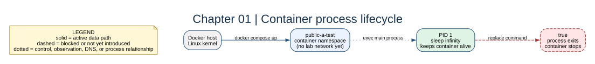

# Chapter 01: Container Process Model



## Key concepts

- **PID 1** is the first process in the container's PID namespace and the
  process whose exit ends the container.
- **`command`** overrides the image's default command for this Compose service.
- **`exec`** replaces a shell wrapper with the real process so signals reach it
  directly.

The container is a process boundary, not a virtual machine. It shares the host
kernel while receiving isolated process, filesystem, and network namespaces.

## Goal

See that a container lives while its PID 1 process lives. Compare a long-lived
`sleep infinity` process with the command override used by Docker.

## Adds

The first chapter creates `public-a-test` without a network. This is the seed
service that later chapters progressively place into the lab.

## Checkpoint

```bash
bash scripts/compose-stage.sh 01 ps
bash scripts/compose-stage.sh 01 exec public-a-test ps
bash scripts/compose-stage.sh 01 exec public-a-test sh -c 'tr "\\0" " " </proc/1/cmdline; printf "\\n"'
```

Explain why replacing `sleep infinity` with `true` makes the container exit.

Expected observation: `/proc/1/cmdline` contains `sleep infinity`, and `ps` can
show that it is the long-lived process. A command that exits normally gives the
container an exit status and Docker stops the service.

## Break it

Run `bash scripts/compose-stage.sh 01 run --rm public-a-test true`, then
compare that one-shot container with the long-running service.

Clean up with `bash scripts/compose-stage.sh 01 down` before moving on.
