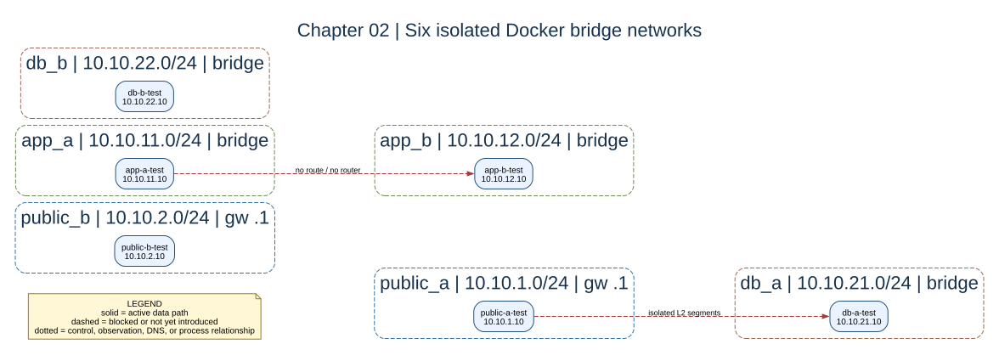

# Chapter 02: CIDR and Bridge Networks



## Key Concepts

### What Is a Network?

A network is a group of devices or interfaces that can communicate with one
another using a defined addressing and forwarding scheme.

In this lab, each Docker bridge network creates a separate Layer-2 network
segment.

### How Does Networking Work in Docker?

Docker can create virtual networks and attach container interfaces to them.

For a user-defined bridge network, Docker creates:

- a Linux bridge on the host;
- a virtual Ethernet interface for each connected container;
- an IP address for each container interface;
- a gateway address for the bridge;
- Docker-managed DNS for containers on the network.

Containers connected to the same bridge can communicate directly at Layer 2.

Containers on different bridge networks cannot communicate directly unless
routing is introduced and a routing path is created between those networks.

### IPv4 and CIDR

An IPv4 address contains **32 bits**, divided into four 8-bit octets.

For example:

```text
10.10.11.10

00001010 | 00001010 | 00001011 | 00001010
   8 bits     8 bits     8 bits     8 bits
```

Examples:

```text
10 = 00001010
11 = 00001011
```

CIDR notation tells us how many of the 32 bits belong to the network portion.

| CIDR | Network Bits | Host Bits | Total Addresses |
| --- | ---: | ---: | ---: |
| `/24` | 24 | 8 | 256 |
| `/16` | 16 | 16 | 65,536 |
| `/8` | 8 | 24 | 16,777,216 |

The general formula is:

```text
Host bits = 32 - CIDR prefix
Total addresses = 2^(host bits)
```

For example:

```text
10.10.11.0/24

First 24 bits = network portion
Last 8 bits   = host portion
```

### Docker Bridge Networks

A **user-defined bridge** is a Docker-managed Layer-2 network segment.

### Docker IPAM

**IPAM** means IP Address Management.

Docker IPAM allocates and tracks IP addresses for containers attached to Docker
networks.

In this lab, we explicitly assign fixed IP addresses in Compose.

This is not DHCP. Docker configures the container interface directly.

### Docker Bridge Gateway

Docker normally uses the `.1` address as the bridge gateway.

For example:

```text
10.10.11.1 = Docker bridge gateway
```

Later in the lab, our own router will use:

```text
10.10.11.2 = lab-router
```

These are two different devices with different roles.

---

## Goal

Create six user-defined bridge networks with explicit `/24` CIDRs and fixed
container addresses.

At the end of this chapter, you should be able to:

- explain what an IPv4 address is;
- explain what `/24` means;
- identify a container's network interface;
- inspect a container's routing table;
- explain why containers on different bridges cannot communicate directly.

---

## What This Stage Adds

The original `public-a-test` service is attached to the `public_a` network.

Five additional diagnostic containers and five additional bridge networks are
also created.

The six networks are:

```text
public_a   10.10.1.0/24
public_b   10.10.2.0/24
app_a      10.10.11.0/24
app_b      10.10.12.0/24
db_a       10.10.21.0/24
db_b       10.10.22.0/24
```

No router exists yet.

This means the six bridge networks are isolated from one another.

---

## Tasks

1. Start the lab.
2. Confirm that all containers are running.
3. Confirm that all six Docker networks exist.
4. Inspect a container's network interfaces.
5. Inspect a container's routing table.
6. Test communication between two different bridge networks.

---

## Checkpoint

### 1. Start the Lab

```bash
bash scripts/compose-stage.sh 02 up -d
```

### 2. Confirm the Containers Are Running

```bash
bash scripts/compose-stage.sh 02 ps
```

You should see six running services.

### 3. Confirm the Docker Networks Exist

```bash
docker network ls
```

You should see networks similar to:

```text
NETWORK ID     NAME                     DRIVER    SCOPE
xxxxxxxxxxxx   docker-subnet_app_a      bridge    local
xxxxxxxxxxxx   docker-subnet_app_b      bridge    local
xxxxxxxxxxxx   docker-subnet_db_a       bridge    local
xxxxxxxxxxxx   docker-subnet_db_b       bridge    local
xxxxxxxxxxxx   docker-subnet_public_a   bridge    local
xxxxxxxxxxxx   docker-subnet_public_b   bridge    local
```

Other Docker networks may also appear on your machine.

---

## Inspect a Container's Network Interfaces

We will inspect `public-a-test`, which is attached to the `public_a` network.

Run:

```bash
bash scripts/compose-stage.sh 02 exec public-a-test ip addr
```

You should see output similar to:

```text
1: lo: <LOOPBACK,UP,LOWER_UP> mtu 65536 ...
    inet 127.0.0.1/8 scope host lo

2: eth0@if139: <BROADCAST,MULTICAST,UP,LOWER_UP> mtu 1500 ...
    inet 10.10.1.10/24 brd 10.10.1.255 scope global eth0
```

This container has two important interfaces:

```text
lo    = loopback interface
eth0  = container network interface
```

The loopback address is:

```text
127.0.0.1
```

The container's network address is:

```text
10.10.1.10/24
```

### Reading the Interface Output

This line:

```text
inet 10.10.1.10/24 brd 10.10.1.255 scope global eth0
```

means:

```text
10.10.1.10   = container IP address
/24          = subnet prefix
10.10.1.255  = broadcast address
eth0         = network interface
```

A `/24` provides **256 total IPv4 addresses** in the subnet.

It does not mean all 256 addresses are available for containers.

---

## Inspect the Routing Table

Now inspect the routing table inside `app-a-test`:

```bash
bash scripts/compose-stage.sh 02 exec app-a-test ip route
```

Expected output:

```text
10.10.11.0/24 dev eth0 scope link src 10.10.11.10
```

Breakdown:

```text
10.10.11.0/24
= destination network

dev eth0
= use the eth0 interface

scope link
= the destination network is directly connected

src 10.10.11.10
= use 10.10.11.10 as the source IP address
```

The important observation is that there is no route to:

```text
10.10.12.0/24
```

At this stage, there is also no router connecting `app_a` and `app_b`.

---

## Expected Observation

`app-a-test` uses:

```text
10.10.11.10/24
```

while `app-b-test` uses:

```text
10.10.12.10/24
```

These addresses belong to different Layer-2 networks.

The current topology is:

```text
app_a                           app_b

10.10.11.10                    10.10.12.10
app-a-test                     app-b-test
     |                              |
     v                              v
Docker bridge                  Docker bridge

            no router
               X
```

A packet between these networks needs a Layer-3 routing device.

At this stage, no such device exists.

---

## Break It

Try to ping `app-b-test` from `app-a-test`:

```bash
bash scripts/compose-stage.sh 02 exec app-a-test ping -c 2 10.10.12.10
```

The failure is expected.

The packet cannot reach `10.10.12.10` because:

```text
app-a-test
10.10.11.10
    |
    v
routing table
    |
    X no route to 10.10.12.0/24
```

This failure demonstrates network isolation.

It does not mean either container is unhealthy.

---

## Clean Up

Remove the resources created for this stage:

```bash
bash scripts/compose-stage.sh 02 down
```
