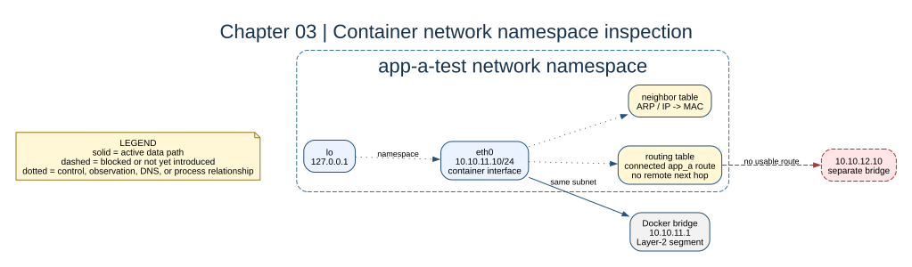

# Chapter 03: Network Namespaces and Interfaces



## Key concepts

- A **network namespace** has its own `lo`, interfaces, routes, and neighbor
  cache.
- A container interface is one end of a virtual Ethernet pair; Docker connects
  the other end to the bridge.
- The **neighbor table** is a learned IP-to-MAC cache, not a machine inventory.

## Goal

Inspect the network namespace created for each container and distinguish local
interfaces, connected routes, and the neighbor table.

## Adds

This chapter changes no topology. It turns the previous chapter into an
observation exercise before permissions and routing are introduced.

## Checkpoint

```bash
bash scripts/compose-stage.sh 03 exec app-a-test ip -br addr
bash scripts/compose-stage.sh 03 exec app-a-test ip route
bash scripts/compose-stage.sh 03 exec app-a-test ip neigh
```

Record the interface, route, and ARP/neighbor differences before and after a
same-subnet ping.

Expected observation: a same-subnet ping can populate an ARP neighbor entry;
the remote `10.10.12.10` address remains outside the local connected route.

## Break it

Inspect `ip route get 10.10.12.10` and explain why the result cannot name a
reachable next hop yet.

The namespace inspection is read-only. It prepares the learner to distinguish a
missing route from a later firewall or application failure.
