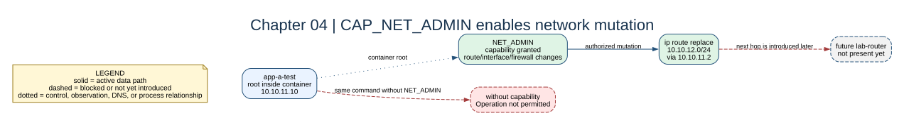

# Chapter 04: Linux Capabilities



## Key concepts

- **Linux capabilities** split privileged root operations into smaller
  permissions.
- **`CAP_NET_ADMIN`** permits route, interface, and many firewall changes in
  the container's namespace.
- **`CAP_NET_RAW`** supports raw packet operations used by tools such as ping
  and packet capture.

Root inside a container is still restricted root. Grant only the capabilities
needed by the experiment; do not treat `cap_add` as a harmless default.

## Goal

Understand why container root cannot automatically change network state and
why `CAP_NET_ADMIN` is the narrow capability needed for route experiments.

## Adds

All diagnostic services receive `NET_ADMIN` and use a reusable lab-tools image
containing `iproute2`, `iptables`, `tcpdump`, `curl`, `nc`, and Python.

## Checkpoint

```bash
bash scripts/compose-stage.sh 04 exec app-a-test ip route add 10.10.12.0/24 via 10.10.11.1
bash scripts/compose-stage.sh 04 exec app-a-test ip route
```

Compare this with the permission failure you would get without the capability.

Expected observation: with `NET_ADMIN`, the route appears in `ip route`; without
it, the command fails with `Operation not permitted`. The capability authorizes
the mutation but does not make the next hop or the destination reachable.

## Break it

Remove `NET_ADMIN` from one service in this overlay temporarily and recreate
that service. Restore it before continuing.
