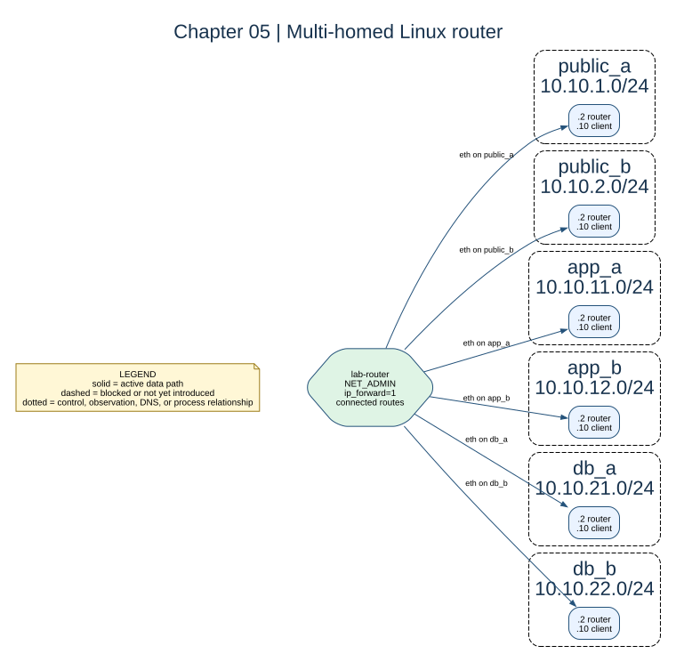

# Chapter 05: Multi-Homed Router Container



## Key concepts

- **Multi-homed** means one node has interfaces on multiple subnets.
- A **connected route** is installed automatically when an interface has an IP
  and prefix on that subnet.
- **Forwarding** is the kernel action of moving a packet between interfaces;
  it is different from the router's own endpoint traffic.

## Goal

Build a Linux container with one interface on every lab subnet and enable IPv4
forwarding.

## Adds

`lab-router` is attached as `.2` to all six networks. Connected routes appear
automatically; no static route is needed on the router for those subnets.

## Checkpoint

```bash
bash scripts/compose-stage.sh 05 exec lab-router ip -br addr
bash scripts/compose-stage.sh 05 exec lab-router ip route
bash scripts/compose-stage.sh 05 exec lab-router sysctl net.ipv4.ip_forward
```

The router can now receive traffic on one interface and forward it in
principle, but clients still do not know to use it.

Expected observation: the router has six connected `/24` routes and
`net.ipv4.ip_forward = 1`. Ordinary containers still need their own remote
routes; adding a router does not rewrite every client routing table.

## Break it

Set `net.ipv4.ip_forward` to `0` inside the router and compare endpoint
connectivity with forwarded connectivity.
