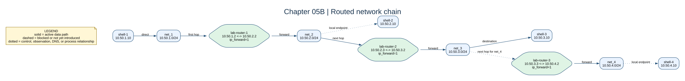

# Chapter 05B: Routed Network Chain



## Key Concepts

### What Is a Network Chain?

A network chain is a sequence of Layer-3 networks joined by routers.

```text
net_1 -- lab-router-1 -- net_2 -- lab-router-2 -- net_3 -- lab-router-3 -- net_4
```

```text
+--------------------------+    +--------------------------+    +--------------------------+    +--------------------------+
| net_1                    |    | net_2                    |    | net_3                    |    | net_4                    |
| 10.50.1.0/24             |    | 10.50.2.0/24             |    | 10.50.3.0/24             |    | 10.50.4.0/24             |
|                          |    |                          |    |                          |    |                          |
|   +------------------+   |    |   +------------------+   |    |   +------------------+   |    |   +------------------+   |
|   | shell-1          |   |    |   | shell-2          |   |    |   | shell-3          |   |    |   | shell-4          |   |
|   | 10.50.1.10       |   |    |   | 10.50.2.10       |   |    |   | 10.50.3.10       |   |    |   | 10.50.4.10       |   |
|   +------------------+   |    |   +------------------+   |    |   +------------------+   |    |   +------------------+   |
|                          |    |                          |    |                          |    |                          |
|                +--------------------+          +--------------------+          +--------------------+                |
|                | lab-router-1       |          | lab-router-2       |          | lab-router-3       |                |
|                | 10.50.1.2          |          | 10.50.2.3          |          | 10.50.3.3          |                |
+----------------| 10.50.2.2          |----------| 10.50.3.2          |----------| 10.50.4.2          |----------------+
                 +--------------------+          +--------------------+          +--------------------+
```

Each router touches exactly two neighboring networks. A packet may therefore
need multiple routers to reach a remote subnet.

### Connected Routes vs Static Routes

A connected route appears automatically when a node has an interface on that
subnet.

A static route is added manually to tell Linux which next hop to use for a
remote subnet.

### What Is a Hop?

A hop is one Layer-3 forwarding step through a router.

If `shell-1` wants to reach `shell-3`, the packet must hop between routers until it reaches its destination.
```text
shell-1
   |
   v
lab-router-1   <- hop 1
   |
   v
lab-router-2   <- hop 2
   |
   v
shell-3
```

### Forward and Return Paths

A forward path is not enough.

```text
forward:
shell-1 -> lab-router-1 -> lab-router-2 -> shell-3
```

The reply also needs a valid return path:

```text
return:
shell-3 -> lab-router-2 -> lab-router-1 -> shell-1
```

---

## Goal

By the end of this lab you should be able to:

- identify connected routes;
- identify where static routes are required;
- choose the correct next hop;
- build a multi-hop route manually;
- build the return path manually;
- inspect route selection with `ip route get`;
- observe router hops with `traceroute`;
- break one route and diagnose where the path fails;
- automate known-good routes only after understanding them.


## Chapter Progression

This chapter builds directly on Chapter 05.

In Chapter 05, one multi-homed router was directly connected to every lab network.

In Chapter 05B, no single router knows every network. The learner now builds the route one hop at a time:

```text
Chapter 05
one router
+
directly connected networks
        ↓
Chapter 05B
multiple routers
+
static next-hop routes
+
forward path
+
return path
+
traceroute
+
failure diagnosis
+
automation
```

Each part should answer a problem created by the previous part.

---

## Important Lab Rule

The static routes should **not** be preconfigured for the main exercise.

Compose should create:

- four Docker networks;
- four shell containers;
- three router containers;
- router interfaces;
- `NET_ADMIN` and `NET_RAW`;
- `net.ipv4.ip_forward=1` on all routers.

The learner adds the routes manually.

```text
build topology
   ↓
inspect routes
   ↓
predict
   ↓
test failure
   ↓
add one route
   ↓
test again
   ↓
follow the packet
```

---

## Stage Topology

```text
net_1   10.50.1.0/24
net_2   10.50.2.0/24
net_3   10.50.3.0/24
net_4   10.50.4.0/24
```

```text
shell-1   10.50.1.10
shell-2   10.50.2.10
shell-3   10.50.3.10
shell-4   10.50.4.10
```

```text
lab-router-1
  net_1: 10.50.1.2
  net_2: 10.50.2.2

lab-router-2
  net_2: 10.50.2.3
  net_3: 10.50.3.2

lab-router-3
  net_3: 10.50.3.3
  net_4: 10.50.4.2
```

---

# Part 1: Start With Only Connected Routes

## Task 1: Start the Lab

```bash
bash scripts/compose-stage.sh 05b up -d --build
```

Confirm:

```bash
bash scripts/compose-stage.sh 05b ps
```

You should have seven services:

```text
shell-1
shell-2
shell-3
shell-4
lab-router-1
lab-router-2
lab-router-3
```

---

## Task 2: Inspect the Transit Network

We have four different networks: `net_1`, `net_2`, `net_3`, and `net_4`.

```text
a. 3 routers
   lab-router-1, lab-router-2, lab-router-3

b. 4 shells (one inside each subnet)
   shell-1, shell-2, shell-3, shell-4
 
```

Next, we break down the resources in each network.
```text
`net_1` ====> shell-1 and lab-router-1
`net_2` ====> shell-2,  lab-router-1, lab-router-2
`net_3` ====> shell-3, lab-router-2, lab-router-3
`net_4` ====> shell-4,  lab-router-3 
```

Let's inspect `net_1`
```bash
docker network inspect docker-subnet_net_1
```

You should find:

```text
shell-1       10.50.1.10
lab-router-1   10.50.1.2
```

Let's inspect `net_2`
```bash
docker network inspect docker-subnet_net_2
```

You should find:

```text
shell-2        10.50.2.10
lab-router-1   10.50.2.2
lab-router-2   10.50.2.3
```


Let's inspect `net_3`

```bash
docker network inspect docker-subnet_net_3
```

```text
shell-3        10.50.3.10
lab-router-2   10.50.3.2 
lab-router-3   10.50.3.3
```

Let's inspect `net_4`

```bash
docker network inspect docker-subnet_net_4
```

```text
shell-4        10.50.4.10
lab-router-3   10.50.4.2
```

----------

## Next Step

We have confirmed which containers and routers share each Docker network.

Next, inspect the routing tables to see what Linux already knows automatically before adding static routes.

---

# Part 2: Inspect What Linux Already Knows


## Task 3: Inspect `shell-1`

Check the shell IP address. 
```bash
bash scripts/compose-stage.sh 05b exec shell-1 ip addr
```
You should see output similar to:

```text
1: lo: <LOOPBACK,UP,LOWER_UP> mtu 65536 qdisc noqueue state UNKNOWN group default qlen 1000
    link/loopback 00:00:00:00:00:00 brd 00:00:00:00:00:00
    inet 127.0.0.1/8 scope host lo
       valid_lft forever preferred_lft forever
    inet6 ::1/128 scope host proto kernel_lo
       valid_lft forever preferred_lft forever

2: eth0@if255: <BROADCAST,MULTICAST,UP,LOWER_UP> mtu 1500 qdisc noqueue state UP group default
    link/ether e6:3b:21:b9:69:c3 brd ff:ff:ff:ff:ff:ff link-netnsid 0
    inet 10.50.1.10/24 brd 10.50.1.255 scope global eth0
       valid_lft forever preferred_lft forever
```

The important address is:

```text
10.50.1.10/24
```


```bash
bash scripts/compose-stage.sh 05b exec shell-1 ip route
```

The routes available in the shell are:
```text
default via 10.50.1.1 dev eth0
10.50.1.0/24 dev eth0 proto kernel scope link src 10.50.1.10
```

subnet ================> 10.50.1.0/24
shell IP address ======>  10.50.1.10
default gateway =======> 10.50.1.1

Note: Docker configures a default gateway for containers on each bridge network.

For `shell-1`, that gateway is:

```text
10.50.1.1
```

If a destination does not match a more specific route, Linux sends the packet to this default gateway.

This does **not** mean that the remote destination is guaranteed to be reachable through that gateway. In this lab, we want traffic for the custom subnets to use our router containers instead.

-------------------------------------------


### Inspect the Route to `shell-3`
Before testing connectivity, inspect how `shell-1` would currently try to reach `shell-3`.

```bash
bash scripts/compose-stage.sh 05b exec shell-1   ip route get 10.50.3.10
```

```text
10.50.3.10 via 10.50.1.1 dev eth0 src 10.50.1.10 uid 0
```
Meaning:
```text
destination = 10.50.3.10
next hop    = 10.50.1.1
interface   = eth0
source IP   = 10.50.1.10
```
Record the result.

This means that `shell-1` currently chooses Docker's default gateway (`10.50.1.1`) because no more specific route exists.

That route lookup only tells us which next hop Linux would choose. It does not prove that `shell-3` is reachable.

Now test actual reachability with `ping`.

---

Test
```bash
bash scripts/compose-stage.sh 05b exec shell-1 sh

ping -c 3 10.50.3.10
```

You should see packets transmitted with no replies received.

```text
3 packets transmitted, 0 received, 100% packet loss, time 2066ms
```


## Task 4: Inspect `lab-router-1`

Now inspect `lab-router-1` to see why it can connect `net_1` and `net_2`.

```bash
bash scripts/compose-stage.sh 05b exec lab-router-1 ip addr
```
```text
1: lo: <LOOPBACK,UP,LOWER_UP> mtu 65536 qdisc noqueue state UNKNOWN group default qlen 1000
    link/loopback 00:00:00:00:00:00 brd 00:00:00:00:00:00
    inet 127.0.0.1/8 scope host lo
       valid_lft forever preferred_lft forever
    inet6 ::1/128 scope host proto kernel_lo
       valid_lft forever preferred_lft forever
2: eth0@if261: <BROADCAST,MULTICAST,UP,LOWER_UP> mtu 1500 qdisc noqueue state UP group default
    link/ether 6a:b1:8c:5e:b7:23 brd ff:ff:ff:ff:ff:ff link-netnsid 0
    inet 10.50.1.2/24 brd 10.50.1.255 scope global eth0
       valid_lft forever preferred_lft forever
3: eth1@if264: <BROADCAST,MULTICAST,UP,LOWER_UP> mtu 1500 qdisc noqueue state UP group default
    link/ether ca:4f:d8:79:ab:0c brd ff:ff:ff:ff:ff:ff link-netnsid 0
    inet 10.50.2.2/24 brd 10.50.2.255 scope global eth1
       valid_lft forever preferred_lft forever
```

```text
 inet 10.50.2.2/24 brd 10.50.2.255 scope global eth1
```

Next, inspect the routes available on `lab-router-1`.

Note: a network interface is the point through which the kernel sends and receives network traffic.

Applications interact with sockets. The kernel networking stack moves data between sockets and network interfaces.

```bash
bash scripts/compose-stage.sh 05b exec lab-router-1 ip route
```

```text
10.50.1.0/24 dev eth0 proto kernel scope link src 10.50.1.2
10.50.2.0/24 dev eth1 proto kernel scope link src 10.50.2.2
```
You should find connected routes for:

```text
10.50.1.0/24
10.50.2.0/24
```

Notice that `lab-router-1` has two network-facing interfaces plus loopback, and two connected network routes. 

```text
10.50.1.0/24 dev eth0 proto kernel scope link src 10.50.1.2

This shows that on `net_1` (`10.50.1.0/24`), `lab-router-1` has the IP address `10.50.1.2`.

 and 

10.50.2.0/24 dev eth1 proto kernel scope link src 10.50.2.2

This shows that on `net_2` (`10.50.2.0/24`), `lab-router-1` has the IP address `10.50.2.2`.

```

`lab-router-1` is attached to both `net_1` and `net_2`, so Linux automatically creates connected routes for both networks.

With `net.ipv4.ip_forward=1`, the kernel can forward packets between those two network interfaces.

Previously, `shell-1` sent unmatched traffic to Docker's default gateway. For this lab, we want traffic for `net_2` to use `lab-router-1` instead.

The diagram below shows the intended path.

```text
+---------------------------+        +---------------------------+
| net_1                     |        | net_2                     |
| 10.50.1.0/24              |        | 10.50.2.0/24              |
|                           |        |                           |
|   +-------------------+   |        |   +-------------------+   |
|   | shell-1           |   |        |   | shell-2           |   |
|   | 10.50.1.10        |   |        |   | 10.50.2.10        |   |
|   +-------------------+   |        |   +-------------------+   |
|                           |        |                           |
| packet >  <><>  +-------------------------+ <> <> < packet   |
|   sent           | lab-router-1            |         received   |
|    from shell-2  |                         |                   |
|                  | net_1: 10.50.1.2        |                   |
+------------------| net_2: 10.50.2.2        |--------------------+
                   +-------------------------+
```


---

## Task 5: Inspect `lab-router-2`

```bash
bash scripts/compose-stage.sh 05b exec lab-router-2 ip route
```

You should find connected routes for:

```text
10.50.2.0/24 dev eth0 proto kernel scope link src 10.50.2.3
10.50.3.0/24 dev eth1 proto kernel scope link src 10.50.3.2
```

Notice that `lab-router-1` has two network-facing interfaces plus loopback, and two connected network routes. 

```text
10.50.2.0/24 dev eth0 proto kernel scope link src 10.50.2.3

This shows that on `net_2` (`10.50.2.0/24`), `lab-router-2` has the IP address `10.50.2.3`.

 and 

10.50.3.0/24 dev eth1 proto kernel scope link src 10.50.3.2

This shows that on `net_3` (`10.50.3.0/24`), `lab-router-2` has the IP address `10.50.3.2`.

```


```text
+---------------------------+        +---------------------------+
| net_2                     |        | net_3                     |
| 10.50.2.0/24              |        | 10.50.3.0/24              |
|                           |        |                           |
|   +-------------------+   |        |   +-------------------+   |
|   | shell-2           |   |        |   | shell-3           |   |
|   | 10.50.2.10        |   |        |   | 10.50.3.10        |   |
|   +-------------------+   |        |   +-------------------+   |
|                           |        |                           |
| packet >  <><>  +-------------------------+ <> <> < packet   |
|   sent           | lab-router-2            |         received   |
|    from shell-1  |                         |                   |
|                  | net_2: 10.50.2.3        |                   |
+------------------| net_3: 10.50.3.2        |--------------------+
                   +-------------------------+
```

At this point:

```text
shell-1 knows net_1
router-1 knows net_1 and net_2
router-2 knows net_2 and net_3
```

The full path has not been configured yet.

---

## Next Step

We now know the connected routes on the source and routers.

Next, test connectivity before adding custom routes so we can observe the failure state.

---

# Part 3: Prove the Path Is Broken

## Task 6: Ping Before Adding Routes

First, enter `shell-1`.
```bash
bash scripts/compose-stage.sh 05b exec shell-1 sh
```


Next, try to reach `shell-2`.
```bash
ping -c 2 10.50.2.10
```

```text
--- 10.50.2.10 ping statistics ---
2 packets transmitted, 0 received, 100% packet loss, time 1054ms
```
The failure is expected.

The ping fails because `shell-1` has not yet been told to use `lab-router-1` for `net_2`.

Next, investigate where Linux is currently sending those packets. 
From inside `shell-1`, inspect the selected route:

```bash
ip route get 10.50.2.10
```

```text
10.50.2.10 via 10.50.1.1 dev eth0 src 10.50.1.10 uid 0
    cache
```

The route lookup shows that packets are currently sent to Docker's default gateway (`10.50.1.1`).

That is not the custom routing path we want for this lab.

Exit the shell:
```bash
exit
```

### Question

Where does the failure happen first?

```text
A. shell-3
B. lab-router-2
C. lab-router-1
D. shell-1
```

### Hint

The source host must first know where to send the packet.

---

## Next Step

The ping failed because `shell-1` used Docker's default gateway instead of our custom router.

Next, add a more specific route so `shell-1` uses `lab-router-1`.

---

# Part 4: Teach `shell-1` Its First Next Hop

Now we will add a new route.

## Task 7: Add the Source Route
We have learned that `lab-router-1` is directly reachable from `shell-1` and is also directly connected to `net_2`.

With IPv4 forwarding enabled, it can act as the Layer-3 path between the two networks.

`lab-router-1` is directly reachable from `shell-1`.

Add:

This command adds a more specific route to the `shell-1` routing table. 

First, confirm the current routing table.
```bash
bash scripts/compose-stage.sh 05b exec shell-1 ip route
```
```text
default via 10.50.1.1 dev eth0
10.50.1.0/24 dev eth0 proto kernel scope link src 10.50.1.10


This shows the connected route plus Docker's default route.
```


Next, add the new route.


```bash
bash scripts/compose-stage.sh 05b exec shell-1   ip route add 10.50.2.0/24 via 10.50.1.2
```

Confirm the new route was added:

```bash
bash scripts/compose-stage.sh 05b exec shell-1 ip route
```

```text
default via 10.50.1.1 dev eth0
10.50.1.0/24 dev eth0 proto kernel scope link src 10.50.1.10
*10.50.2.0/24 via 10.50.1.2 dev eth0 --> new route added
```

Then:
Now ask Linux how it will reach `net_2` and confirm that the more specific route through `lab-router-1` wins over the default route.
```bash
bash scripts/compose-stage.sh 05b exec shell-1   ip route get 10.50.2.10
```

Expected:

```text
10.50.2.10 via 10.50.1.2 dev eth0 src 10.50.1.10 uid 0
```

### Key Observation

`shell-1` does not need to know the full path.

For the current one-hop test, it only needs this next hop:

```text
net_2 -> 10.50.1.2
```

Later, we will add another specific route for `net_3` through the same local router.

Right now, `shell-1` knows that `lab-router-1` is the next hop. 
It does not need to know the full path.

Now extend the idea.

Suppose `shell-1` wants to reach `shell-3` on `net_3`.

`shell-1` can send the packet to `lab-router-1`, but `lab-router-1` is not directly connected to `net_3`.

Therefore, `lab-router-1` needs a static route that identifies `lab-router-2` as the next hop.

---

## Task 8: Test Again

```bash
bash scripts/compose-stage.sh 05b exec shell-1   ping -c 2 10.50.2.10
```

It should still fail.

### Question

The forward path now works. Why can `ping` still fail?

Inspect:

```bash
bash scripts/compose-stage.sh 05b exec lab-router-1  ip route get 10.50.2.10
```

You should see:
```text
10.50.2.10 dev eth1 src 10.50.2.2 uid 0
```

Meaning: the lab-router-1 has the route to shell-2 so why does it still fail?

Answer 
```text
shell-1 ----> lab-router-1--------> shell-2

but we will need shell-2 to send the return packets

shell-2 ------> lab-router-1 --------> shell-1

```

so we fix this by adding the return route to shell-2

```bash
bash scripts/compose-stage.sh 05b exec shell-2  ip route add 10.50.1.0/24 via 10.50.2.2
```
---

Next, test again.


```bash
bash scripts/compose-stage.sh 05b exec shell-1   ping -c 2 10.50.2.10
```

```text
--- 10.50.2.10 ping statistics ---
2 packets transmitted, 2 received, 0% packet loss, time 1019ms
```
Packets are now transmitted and replies are successfully received.


## Next Step

We have proved one-hop routing between `net_1` and `net_2`, including the return path.

Next, extend the route to `net_3`, which requires a second router and introduces multi-hop routing.

---

# Part 5: Teach Router 1 the Next Hop


## Task 9: Choose the Correct Next Hop

Which next hop should `lab-router-1` use for `net_3`?

```text
A. 10.50.3.3
B. 10.50.2.3
C. 10.50.2.10
```

Correct answer:

```text
10.50.2.3
```
Now add a route on `lab-router-1` for `net_3`.

`lab-router-1` is not directly connected to `net_3`.

`lab-router-2` is connected to both `net_2` and `net_3`, so `lab-router-2` is the correct next hop.

Add:


```text
+---------------------------+        +---------------------------+        +---------------------------+
| net_1                     |        | net_2                     |        | net_3                     |
| 10.50.1.0/24              |        | 10.50.2.0/24              |        | 10.50.3.0/24              |
|                           |        |                           |        |                           |
|   +-------------------+   |        |   +-------------------+   |        |   +-------------------+   |
|   | shell-1           |   |        |   | shell-2           |   |        |   | shell-3           |   |
|   | 10.50.1.10        |   |        |   | 10.50.2.10        |   |        |   | 10.50.3.10        |   |
|   +-------------------+   |        |   +-------------------+   |        |   +-------------------+   |
|                           |        |                           |        |                           |
|                  +-------------------------+          +-------------------------+                   |
|                  | lab-router-1            |          | lab-router-2            |                   |
|                  |                         |          |                         |                   |
|                  | net_1: 10.50.1.2       |          | net_2: 10.50.2.3         |                   |
+------------------| net_2: 10.50.2.2       |----------| net_3: 10.50.3.2         |------------------+
                   +-------------------------+          +-------------------------+
```

From the diagram above, traffic from `shell-1` to `shell-3` must cross two routers:

```text
shell-1 -> lab-router-1 -> lab-router-2 -> shell-3
```

`lab-router-1` is hop 1 and `lab-router-2` is hop 2.


```bash
bash scripts/compose-stage.sh 05b exec lab-router-1   ip route add 10.50.3.0/24 via 10.50.2.3
```

Confirm:

```bash
bash scripts/compose-stage.sh 05b exec lab-router-1 ip route
```

---

## Task 10: Confirm IPv4 Forwarding

Remember: `net.ipv4.ip_forward=1` allows the Linux kernel to forward IPv4 packets between interfaces.
Confirm that this setting is enabled on both `lab-router-1` and `lab-router-2`.

```bash
bash scripts/compose-stage.sh 05b exec lab-router-1   sysctl net.ipv4.ip_forward

bash scripts/compose-stage.sh 05b exec lab-router-2   sysctl net.ipv4.ip_forward
```

Expected:

```text
net.ipv4.ip_forward = 1
```

Remember:

```text
two interfaces
       !=
packet forwarding enabled
```

---

## Next Step

`lab-router-1` now knows that `lab-router-2` is the next hop for `net_3`.

Next, follow the complete forward path from `shell-1` toward `shell-3`.

---

# Part 6: Follow the Forward Path

Before testing the full path, `shell-1` still needs a specific route for `net_3`.

Add:

```bash
bash scripts/compose-stage.sh 05b exec shell-1 \
  ip route add 10.50.3.0/24 via 10.50.1.2
```

Confirm the selected next hop:

```bash
bash scripts/compose-stage.sh 05b exec shell-1 \
  ip route get 10.50.3.10
```

Expected:

```text
10.50.3.10 via 10.50.1.2 dev eth0 src 10.50.1.10
```

The intended path is now:

```text
shell-1
10.50.1.10
     |
     | net_3 via 10.50.1.2
     v
lab-router-1
     |
     | net_3 via 10.50.2.3
     v
lab-router-2
     |
     | net_3 directly connected
     v
shell-3
10.50.3.10
```

Test:

```bash
bash scripts/compose-stage.sh 05b exec shell-1   ping -c 2 10.50.3.10
```

It may still fail.

The request can now reach the destination, but the reply needs its own route.

---

## Next Step

The forward path can now reach `shell-3`, but end-to-end communication still requires a return path.

Next, configure the reverse path from `shell-3` back to `shell-1`.

---

# Part 7: Build the Return Path

## Task 11: Configure `shell-3`

`shell-3` is on `net_3`.

The forward path can now reach `shell-3`, but `shell-3` still needs to know how to return traffic to `net_1`.

Because `lab-router-2` is directly reachable from `shell-3` at `10.50.3.2`, it will be the next hop for the return path.


Inspect:

```bash
bash scripts/compose-stage.sh 05b exec shell-3 ip route
```

```text
default via 10.50.3.1 dev eth0
10.50.3.0/24 dev eth0 proto kernel scope link src 10.50.3.10
```
This shows that `shell-3` currently has its connected route plus Docker's default route.


### Prediction

Which router should `shell-3` use to return traffic to `net_1`?

```text
lab-router-2 = 10.50.3.2
lab-router-3 = 10.50.3.3
```

Enter `shell-3`:

```bash
bash scripts/compose-stage.sh 05b exec shell-3  sh
```

Next, add the route:
```bash
ip route add 10.50.1.0/24 via 10.50.3.2
```
This route tells `shell-3` that traffic for `net_1` should be sent to `lab-router-2` at `10.50.3.2`.

Confirm that the route exists:
```bash
ip route 
```
You should see:

```text
default via 10.50.3.1 dev eth0
10.50.1.0/24 via 10.50.3.2 dev eth0
==> 10.50.3.0/24 dev eth0 proto kernel scope link src 10.50.3.10
```

Exit the container:
```bash
exit
```
---

## Task 12: Configure `lab-router-2`

We configured `lab-router-1` to send packets for `net_3` to `lab-router-2`.

`lab-router-2` is already directly connected to `net_3`, so it does not need a static route to reach `shell-3`.

What it still needs is a return route to `net_1`.

Add:

```bash
bash scripts/compose-stage.sh 05b exec lab-router-2   ip route add 10.50.1.0/24 via 10.50.2.2
```

Now the return path is:

```text
shell-3
     |
     | net_1 via 10.50.3.2
     v
lab-router-2
     |
     | net_1 via 10.50.2.2
     v
lab-router-1
     |
     | net_1 directly connected
     v
shell-1
```

---

## Next Step

Both forward and return paths are now configured.

Next, verify that the full route works in both directions.

---

# Part 8: Prove End-to-End Connectivity

## Task 13: Ping Again

```bash
bash scripts/compose-stage.sh 05b exec shell-1   ping -c 2 10.50.3.10
```

Expected:

```text
2 packets transmitted, 2 packets received, 0% packet loss
```

You have now manually built:

```text
forward path
+
return path
```

---

## Completed Route Summary: `shell-1` to `shell-3`

At this point, four manually added static routes make the complete path work.

> These commands summarize the final configuration. If you already completed the previous tasks, do not run them again with `ip route add`, because the routes already exist.

### Forward Path

On `shell-1`:

```bash
bash scripts/compose-stage.sh 05b exec shell-1 \
  ip route add 10.50.3.0/24 via 10.50.1.2
```

This means:

```text
destination: net_3
next hop:    lab-router-1
             10.50.1.2
```

On `lab-router-1`:

```bash
bash scripts/compose-stage.sh 05b exec lab-router-1 \
  ip route add 10.50.3.0/24 via 10.50.2.3
```

This means:

```text
destination: net_3
next hop:    lab-router-2
             10.50.2.3
```

`lab-router-2` does not need a static route to `net_3` because:

```text
10.50.3.0/24
```

is directly connected to it.

The forward path is therefore:

```text
shell-1
10.50.1.10
     |
     | net_3 via 10.50.1.2
     v
lab-router-1
10.50.1.2 / 10.50.2.2
     |
     | net_3 via 10.50.2.3
     v
lab-router-2
10.50.2.3 / 10.50.3.2
     |
     | net_3 directly connected
     v
shell-3
10.50.3.10
```

### Return Path

On `shell-3`:

```bash
bash scripts/compose-stage.sh 05b exec shell-3 \
  ip route add 10.50.1.0/24 via 10.50.3.2
```

This means:

```text
destination: net_1
next hop:    lab-router-2
             10.50.3.2
```

On `lab-router-2`:

```bash
bash scripts/compose-stage.sh 05b exec lab-router-2 \
  ip route add 10.50.1.0/24 via 10.50.2.2
```

This means:

```text
destination: net_1
next hop:    lab-router-1
             10.50.2.2
```

`lab-router-1` does not need a static route to `net_1` because `net_1` is directly connected.

The return path is:

```text
shell-3
10.50.3.10
     |
     | net_1 via 10.50.3.2
     v
lab-router-2
10.50.3.2 / 10.50.2.3
     |
     | net_1 via 10.50.2.2
     v
lab-router-1
10.50.2.2 / 10.50.1.2
     |
     | net_1 directly connected
     v
shell-1
10.50.1.10
```

### Final Connectivity Test

Run:

```bash
bash scripts/compose-stage.sh 05b exec shell-1 \
  ping -c 3 10.50.3.10
```

Expected:

```text
3 packets transmitted, 3 packets received, 0% packet loss
```

This proves that both the forward path and return path are complete.

### Route Summary

```text
FORWARD

shell-1
10.50.3.0/24 via 10.50.1.2
        |
        v
router-1
10.50.3.0/24 via 10.50.2.3
        |
        v
router-2
10.50.3.0/24 directly connected
        |
        v
shell-3


RETURN

shell-3
10.50.1.0/24 via 10.50.3.2
        |
        v
router-2
10.50.1.0/24 via 10.50.2.2
        |
        v
router-1
10.50.1.0/24 directly connected
        |
        v
shell-1
```

The important lesson is:

```text
A node does not need to know the complete path.

It only needs to know the correct next hop for the destination.
```

---


## Next Step

The ping now succeeds and proves reachability.

Next, use `traceroute` to make the intermediate router hops visible.

---

# Part 9: Observe the Hops

## Task 14: Run `traceroute`

```bash
bash scripts/compose-stage.sh 05b exec shell-1   traceroute -n -m 5 -w 1 10.50.3.10
```

Expected sequence:

```text
1  10.50.1.2
2  10.50.2.3
3  10.50.3.10
```

Meaning:

```text
10.50.1.2   lab-router-1
10.50.2.3   lab-router-2
10.50.3.10  shell-3
```

### Question

Why does `shell-1` only know about `10.50.1.2` even though the packet crosses
two routers?

### Key Lesson

Each node only needs enough information to choose its own next hop.

---

## Next Step

We have observed a two-hop path.

Next, examine a middle network where a host can choose between two different routers.

---

# Part 10: A Host With Two Router Choices

`net_3` contains:

```text
shell-3       10.50.3.10
lab-router-2  10.50.3.2
lab-router-3  10.50.3.3
```

So `shell-3` can use different routers for different destinations.

To the left:

```text
net_1/net_2 -> 10.50.3.2
```

To the right:

```text
net_4 -> 10.50.3.3
```

## Task 15: Add a Route to `net_4`

```bash
bash scripts/compose-stage.sh 05b exec shell-3   ip route add 10.50.4.0/24 via 10.50.3.3
```

Inspect:

```bash
bash scripts/compose-stage.sh 05b exec shell-3 ip route
```

You should now see different next hops for different destination networks.

---

## Next Step

`shell-3` can now select different routers for different destination networks.

Next, extend the same reasoning across all three routers to reach `shell-4`.

---

# Part 11: Challenge — Complete the Full Chain

Your target is:

```text
shell-1 -> router-1 -> router-2 -> router-3 -> shell-4
```

Make this succeed:

```bash
bash scripts/compose-stage.sh 05b exec shell-1   ping -c 2 10.50.4.10
```

Determine:

1. the route needed on `shell-1`;
2. the route needed on `lab-router-1`;
3. the route needed on `lab-router-2`;
4. whether `lab-router-3` needs a static route for `net_4`;
5. the return route on `shell-4`;
6. the return routes needed on the routers.

### Rule

At every node ask:

```text
Is the destination directly connected?

If yes:
send directly.

If no:
which directly reachable router is the correct next hop?
```

---

## Next Step

The complete chain can now be built manually.

Next, remove one route and observe how a single missing forwarding decision breaks the end-to-end path.

---

# Part 12: Break It

Once `shell-1 -> shell-3` works, delete the transit route:

```bash
bash scripts/compose-stage.sh 05b exec lab-router-1   ip route delete 10.50.3.0/24 via 10.50.2.3
```

Run:

```bash
bash scripts/compose-stage.sh 05b exec shell-1   traceroute -n -m 5 -w 1 10.50.3.10
```

Observe:

```text
shell-1 still has a valid source route
but the end-to-end path is broken
```

This demonstrates:

```text
valid source route
       !=
complete end-to-end route
```

---

## Next Step

The path is intentionally broken.

Next, diagnose the failure hop by hop before restoring the route.

---

# Part 13: Diagnose Before Fixing

Walk the path:

```bash
bash scripts/compose-stage.sh 05b exec shell-1   ip route get 10.50.3.10

bash scripts/compose-stage.sh 05b exec lab-router-1   ip route get 10.50.3.10

bash scripts/compose-stage.sh 05b exec lab-router-2   ip route get 10.50.3.10
```

Find the first node that cannot make the correct routing decision.

Restore:

```bash
bash scripts/compose-stage.sh 05b exec lab-router-1   ip route add 10.50.3.0/24 via 10.50.2.3
```

Then retest.

---

## Next Step

The manual path has been restored and diagnosed successfully.

Next, automate the known-good routes so the topology can be recreated consistently.

---

# Part 14: Automate the Known-Good Routes

Only after the learner has manually built and debugged the chain should the
routes move into startup configuration.

This is where:

```bash
ip route replace ...
```

is useful.

`replace` means:

```text
route missing
    -> add it

route already exists
    -> update it
```

The progression is:

```text
manual configuration
      ↓
understand why it works
      ↓
test
      ↓
break
      ↓
debug
      ↓
automate
```

---

## Key Mental Model

```text
connected route
= Linux already knows the subnet because an interface belongs to it
```

```text
static route
= you tell Linux which next hop to use for a remote network
```

```text
next hop
= the directly reachable router that receives the packet next
```

```text
hop
= one Layer-3 forwarding step
```

```text
source route
      +
each router's next-hop decision
      +
return path
      =
end-to-end connectivity
```

---

## Review Checkpoint

Answer these without looking at your final route tables:

1. Why does `lab-router-1` not need a static route to `net_2`?
2. Why can `shell-1` use `10.50.1.2` as a next hop but not `10.50.2.3`?
3. Why does a valid route on `shell-1` not guarantee connectivity?
4. Why does the reply need a separate return path?
5. What is the difference between a connected route and a static route?
6. Why can `shell-3` choose between two routers?
7. What does `ip route get` show?
8. What does `traceroute` show that `ping` does not?
9. Why does each router only need its next hop rather than the complete path?
10. Why should startup automation come after the manual routing exercise?

---

## Chapter Recap

In Chapter 05, one multi-homed router was directly connected to every network it needed to reach.

Chapter 05B introduced a different problem:

```text
the destination may be several routers away
```

That required us to build the route one hop at a time.

We started with only the routes Linux creates automatically:

```text
connected interface
        =
connected route
```

We then observed that `shell-1` initially used Docker's default gateway because no more specific route existed.

```text
10.50.3.10
    |
    v
default via 10.50.1.1
```

We then added a more specific route through our custom router:

```text
10.50.3.0/24 via 10.50.1.2
```

Then we discovered that configuring the source host was not enough.

Every router along the path also had to know its own next hop.

```text
shell-1
   |
   v
router-1
   |
   v
router-2
   |
   v
shell-3
```

Finally, we learned that reaching the destination is only half of end-to-end communication.

The reply also needs a valid return path.

```text
forward path
+
return path
=
working communication
```

The chapter therefore introduced four major routing ideas:

```text
1. connected route
   Linux knows a subnet because an interface is attached to it.

2. static route
   We manually tell Linux how to reach a remote subnet.

3. next hop
   A node only needs to know which directly reachable router receives the packet next.

4. multi-hop routing
   Each router makes its own routing decision until the packet reaches a directly connected destination.
```

The complete mental model is:

```text
destination IP
      |
      v
routing-table lookup
      |
      v
directly connected?
   /       \
 yes       no
  |         |
send       choose
directly   next hop
            |
            v
         next router
            |
            v
        repeat lookup
```

By the end of the chapter, the learner has moved from:

```text
one router connecting two networks
```

to:

```text
multiple routers
+
multiple next-hop decisions
+
forward and return paths
+
traceroute
+
route failure diagnosis
```

The next step is to apply the same reasoning independently to the full chain:

```text
shell-1
   |
   v
router-1
   |
   v
router-2
   |
   v
router-3
   |
   v
shell-4
```

At that point, the learner is no longer following a single prepared path. They are using the routing model developed throughout the chapter to construct one themselves.

---

## Conclusion

A router does not need a complete map of every physical step a packet will take.

It needs a routing table that answers:

```text
For this destination,
where should I send the packet next?
```

Each node repeats that decision.

That is what allows a packet to move through a chain of routers until it reaches a network that one router is directly connected to.

For this lab:

```text
shell-1 knows router-1
router-1 knows router-2
router-2 knows net_3
```

and for the reply:

```text
shell-3 knows router-2
router-2 knows router-1
router-1 knows net_1
```

Together, those individual routing decisions create end-to-end connectivity.

---

## Clean Up

```bash
bash scripts/compose-stage.sh 05b down
```
