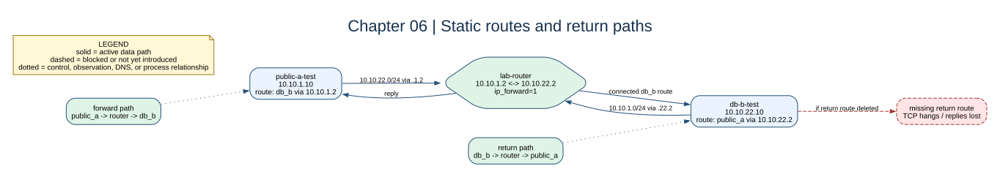

# Chapter 06: Static Routing



## Key concepts

- A **next hop** must be reachable on the sender's local subnet.
- The **forward path** carries the request to the destination; the **return
  path** carries the response back. Both are required for TCP.
- Linux uses the most-specific matching route before considering a default
  route.

## Goal

Teach every diagnostic container that remote lab subnets use the router as the
next hop.

## Adds

The overlay installs routes in both directions. The next hop is always the
router address on the sender's own subnet, such as `10.10.11.2` for `app-a`.

## Checkpoint

```bash
bash scripts/compose-stage.sh 06 exec app-a-test ip route
bash scripts/compose-stage.sh 06 exec app-a-test ping -c 2 10.10.12.10
bash scripts/compose-stage.sh 06 exec public-a-test ping -c 2 10.10.22.10
```

Use `ip route get` to explain the selected gateway before capturing packets.

Expected observation: `ip route get 10.10.22.10` from `app-a-test` names
`10.10.11.2` as the next hop and the local interface. The route is runtime
state, so recreating the container removes it unless an entrypoint reapplies it.

## Break it

Delete the route to `10.10.11.0/24` from `app-b-test` and observe that a
connection can fail even when the forward route on `app-a-test` is correct.
