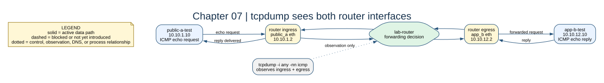

# Chapter 07: Packet Tracing



## Key concepts

- **Ingress** is where a packet enters the router; **egress** is where it leaves
  toward the next subnet.
- `tcpdump -i any` observes all router interfaces in the namespace; `-nn`
  prevents DNS and service-name lookups from hiding the packet fields.
- A capture proves packet movement, not that the application accepted the
  payload.

## Goal

Use `tcpdump` to prove where a packet enters and leaves the router.

## Adds

No service is added. The lab-tools image from chapter 04 already contains the
capture tools, so this chapter adds an observation workflow instead of another
piece of infrastructure.

## Checkpoint

In one terminal run:

```bash
bash scripts/compose-stage.sh 07 exec lab-router tcpdump -i any -nn icmp
```

In another run:

```bash
bash scripts/compose-stage.sh 07 exec public-a-test ping -c 2 10.10.12.10
```

Identify ingress, forwarded egress, reply ingress, and reply egress.

Expected observation: one ICMP request crosses two router interfaces, then the
reply crosses them in reverse. If only one side appears, inspect the capture
interface, route, and return path before changing the firewall.

## Break it

Capture on only one router interface and explain why the opposite half of the
conversation is invisible there.
