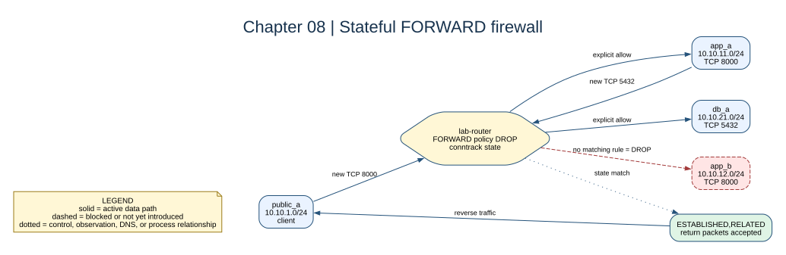

# Chapter 08: Stateful Firewalling



## Key concepts

- The router's **`FORWARD` chain** evaluates packets crossing between router
  interfaces; it is not the same as a container's `INPUT` chain.
- **Conntrack** remembers flows such as TCP `NEW` and `ESTABLISHED`, allowing a
  single return rule to cover reply packets.
- A default policy of **`DROP`** makes rule order and explicit allow rules part
  of the design.

This firewall is deliberately separate from PostgreSQL `pg_hba.conf`: iptables
decides whether a packet can cross the router, while PostgreSQL decides whether
an authenticated database session is accepted after the packet arrives.

## Goal

Replace unrestricted forwarding with a default-deny policy and allow only the
ports required by the application design.

## Adds

The router now permits established return traffic plus these flows:

- public A to app A TCP `8000`;
- public B to app B TCP `8000`;
- both app networks to database A TCP `5432`;
- database B to database A TCP `5432` for replication.

## Checkpoint

```bash
bash scripts/compose-stage.sh 08 exec lab-router iptables -L FORWARD -n -v --line-numbers
bash scripts/compose-stage.sh 08 exec lab-router iptables -S FORWARD
```

Explain why `ESTABLISHED,RELATED` makes one return rule sufficient.

Expected observation: rule counters increase only for matching traffic. ICMP is
not one of the allow rules in this stage, so use the TCP checks introduced by
later chapters when testing port segmentation. A timeout indicates a drop;
`Connection refused` indicates that a host was reached without a listener.

## Break it

Flush the router's `FORWARD` chain and restore it by recreating the router.
Compare a timeout caused by `DROP` with a refusal caused by a service that is
reachable but not listening.

Recreate the router after experiments so its entrypoint restores the intended
policy: `bash scripts/compose-stage.sh 08 up -d --force-recreate lab-router`.
