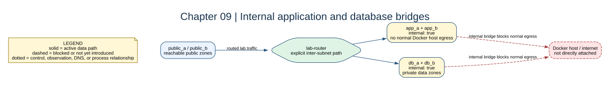

# Chapter 09: Private Networks



## Key concepts

- **`internal: true`** prevents a normal Docker bridge egress path from being
  used for external traffic.
- Private does not mean encrypted, invisible, or unreachable from every other
  container. The lab router can still route between attached internal zones.
- A private bridge is one boundary in the design; routes and firewall policy
  remain separate controls.

## Goal

Make application and database networks private at the Docker bridge layer.

## Adds

`app_a`, `app_b`, `db_a`, and `db_b` receive `internal: true`. They remain
reachable through the explicit lab router, but Docker no longer provides their
normal host egress path.

## Checkpoint

```bash
bash scripts/compose-stage.sh 09 config
bash scripts/compose-stage.sh 09 exec app-a-test ip route
```

Notice that a private network is not the same thing as a firewall policy. It
controls Docker's external attachment; the router still controls forwarded
traffic between lab subnets.

Expected observation: the app has no useful direct path to an external address
before chapter 10, while an explicit route through `lab-router` can still reach
another lab subnet when the firewall permits it.

## Break it

Try to reach a public address from `app-a-test` before the NAT chapter. Record
the route and the failure without changing the stack.
