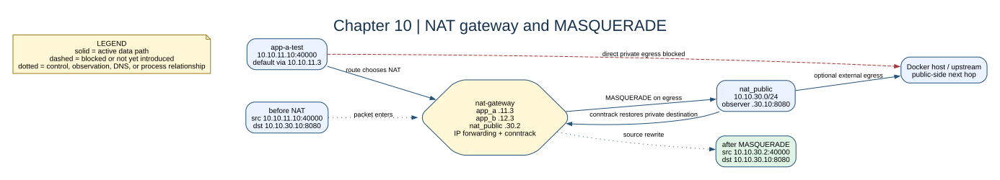

# Chapter 10: NAT Gateway



## Key concepts

- A **default route** is the catch-all route used when no more-specific route
  matches.
- A **NAT gateway** forwards private traffic and records address/port
  translations in conntrack.
- **MASQUERADE** rewrites the source to the current address of the egress
  interface. `SNAT` is the explicit-address alternative.

For an app request from `10.10.11.10:40000` to `10.10.30.10:8080`, the packet
first routes to `10.10.11.3`. The NAT gateway then sends it out `nat_public`
with source `10.10.30.2:40000`. The reply returns to `.30.2`; conntrack maps it
back to `10.10.11.10:40000`. NAT changes addresses after routing chooses the
egress interface; it does not choose the route.

## Goal

Separate routing from address translation and provide controlled egress for
the private application networks.

## Adds

`nat-gateway` is attached to both app networks and `nat_public`. App default
routes point to the NAT gateway; the gateway MASQUERADEs app traffic on its
public-facing interface.

## Checkpoint

```bash
bash scripts/compose-stage.sh 10 exec app-a-test ip route get 10.10.30.10
bash scripts/compose-stage.sh 10 exec nat-gateway iptables -t nat -L POSTROUTING -n -v
```

Routing chooses the egress interface first. MASQUERADE rewrites the source
address afterward; it does not choose a route.

Expected observation: `ip route get 10.10.30.10` from `app-a-test` reports the
NAT gateway as the next hop, and POSTROUTING counters increase after the HTTP
request in `scripts/test-nat.sh`. If counters stay at zero, inspect the route
and egress interface before changing the NAT rule.

## Break it

Delete the NAT gateway's default route while leaving its MASQUERADE rules and
observe that rule counters stay unchanged.

Restore the stage with `bash scripts/compose-stage.sh 10 up -d --force-recreate
nat-gateway`.
