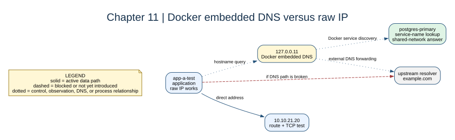

# Chapter 11: Docker DNS



## Key concepts

- `127.0.0.11` is Docker's embedded resolver endpoint inside the container's
  namespace.
- **Service discovery** resolves Compose service names on shared Docker
  networks; it is not the same as resolving public DNS names.
- DNS answers an IP-name question. It does not prove that a route, firewall,
  TCP listener, or application authentication will succeed.

## Goal

Distinguish raw IP connectivity from hostname resolution inside user-defined
Docker networks.

## Adds

No topology change is required. This chapter uses the accumulated stack to
inspect Docker's embedded resolver and deliberately compare IP and DNS tests.

## Checkpoint

```bash
bash scripts/compose-stage.sh 11 exec app-a-test cat /etc/resolv.conf
bash scripts/compose-stage.sh 11 exec app-a-test getent hosts postgres-primary
bash scripts/compose-stage.sh 11 exec app-a-test getent hosts example.com
```

`127.0.0.11` is Docker's embedded DNS endpoint in the container namespace.

Expected observation: `postgres-primary` resolves only where Docker provides a
shared network view, while `example.com` depends on the upstream resolver and
the NAT path. Compare `getent hosts`, `ip route`, and `nc` separately.

## Break it

Temporarily replace `/etc/resolv.conf` with a bad nameserver and compare a
known IP request with a hostname request.

Restore the resolver by recreating the service rather than editing the host:
`bash scripts/compose-stage.sh 11 up -d --force-recreate app-a-test`.
