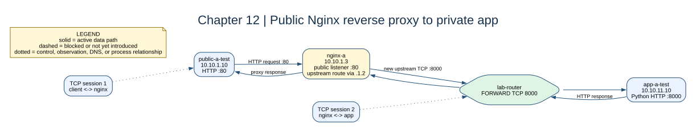

# Chapter 12: Nginx Public Access



## Key concepts

- A **reverse proxy** accepts the public-side request and creates a separate
  upstream request to the application.
- Nginx is an application-layer component, not a replacement for the router or
  its firewall.
- `proxy_pass` selects the upstream application; route rules decide whether the
  Nginx container can reach that upstream subnet.

## Goal

Put an HTTP reverse proxy on each public subnet and route its upstream request
to the matching private app subnet.

## Adds

The app diagnostics become Python HTTP servers. `nginx-a` and `nginx-b` are
public-facing proxies at `.3`, each with a route to its corresponding app.

## Checkpoint

```bash
bash scripts/compose-stage.sh 12 exec public-a-test curl -sS http://10.10.1.3
bash scripts/compose-stage.sh 12 exec public-b-test curl -sS http://10.10.2.3
bash scripts/compose-stage.sh 12 exec nginx-a nginx -t
```

There are two TCP connections: client to Nginx, then Nginx to the app.

Expected observation: the public client can reach `nginx-a:80`, and Nginx can
reach `app-a-test:8000` through the router. A direct public-to-app request is a
different policy test and should not be inferred from proxy success.

## Break it

Stop `nginx-a` and compare the public A failure with a direct app request from
the router. The private app can remain healthy while the public path fails.
