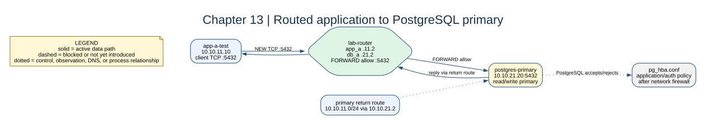

# Chapter 13: PostgreSQL Primary



## Key concepts

- A **TCP handshake** proves transport reachability; it does not prove a valid
  PostgreSQL login or SQL authorization.
- `iptables`/`FORWARD` is the network decision; `pg_hba.conf` is PostgreSQL's
  host/authentication decision after the packet arrives.
- The **primary** is writable and generates WAL for the later standby.

## Goal

Add a PostgreSQL process to the database subnet and validate application-to-
database routing at TCP and SQL layers.

## Adds

`postgres-primary` runs at `10.10.21.20`. Its entrypoint installs return routes
to both app networks and the future replica network. Replication settings are
enabled now so chapter 15 can build on the same primary.

## Checkpoint

```bash
bash scripts/compose-stage.sh 13 exec app-a-test nc -vz -w 3 10.10.21.20 5432
bash scripts/compose-stage.sh 13 exec postgres-primary psql -U labadmin -d labdb -c 'SELECT version();'
bash scripts/compose-stage.sh 13 exec postgres-primary ps -ef
```

`nc` proves a TCP handshake, not database authentication or SQL correctness.

Expected observation: `SELECT pg_is_in_recovery();` returns `f` on the primary,
and `pg_stat_replication` is empty until chapter 15 creates a standby. A
forward rule without the primary's return route can still produce a TCP hang.

## Break it

Remove the primary's route to `10.10.11.0/24` and observe the client-side
connection hang despite the router's forward rule.
