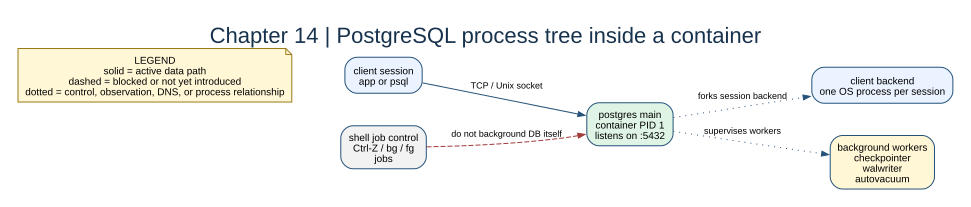

# Chapter 14: PostgreSQL Processes and Job Control



## Key concepts

- PostgreSQL has a main server process, client backend processes, and
  background workers; these are OS processes inside one container namespace.
- The container's PID 1 should remain the supervised PostgreSQL process, not an
  unmanaged shell job.
- `Ctrl-Z` suspends a foreground job; `bg` resumes it in the background; these
  are shell job-control operations, not container persistence mechanisms.

## Goal

Connect the container PID 1 model to PostgreSQL's main process, background
workers, client backends, and foreground/background shell jobs.

## Adds

No topology change. The primary from chapter 13 is the process laboratory.

## Checkpoint

```bash
bash scripts/compose-stage.sh 14 exec postgres-primary ps -ef
bash scripts/compose-stage.sh 14 exec postgres-primary psql -U labadmin -d labdb -c 'SELECT pg_backend_pid();'
```

Use a disposable shell to practice `Ctrl-Z`, `bg`, `jobs`, and `fg`; do not
background the database process itself.

Expected observation: `ps -ef` shows the PostgreSQL process family, while
`pg_backend_pid()` identifies the process serving the current SQL session.

## Break it

Kill one client backend created by a test connection and explain why the
PostgreSQL server and its background processes remain alive.
