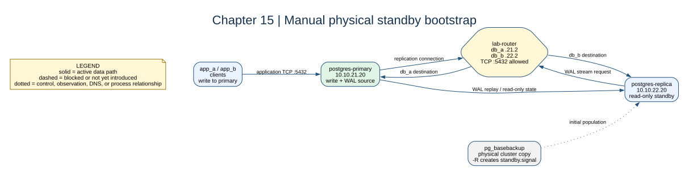

# Chapter 15: Physical Streaming Replication



## Key concepts

- **`pg_basebackup`** copies the physical PostgreSQL cluster; it is not a
  selected-table export.
- **WAL** is generated by the primary, streamed over TCP, and replayed by the
  standby.
- `standby.signal` and `primary_conninfo` tell PostgreSQL to enter recovery and
  reconnect to the primary.
- Physical replication differs from logical replication, which transfers
  logical row changes for selected publications and subscriptions.

## Goal

Initialize a standby by copying the primary cluster with `pg_basebackup` and
observe WAL streaming across the routed database subnets.

## Adds

`postgres-replica` is attached to `db_b` at `10.10.22.20` and intentionally
starts as `sleep infinity`. This prevents the normal image initialization from
creating a conflicting cluster before the base backup.

## Checkpoint

```bash
bash scripts/compose-stage.sh 15 exec postgres-replica sh
```

Inside the shell, run:

```bash
rm -rf /var/lib/postgresql/data/*
install -d -o postgres -g postgres -m 700 /var/lib/postgresql/data
su postgres -c 'PGPASSWORD=replica_password pg_basebackup -h 10.10.21.20 -U replicator -D /var/lib/postgresql/data -Fp -Xs -P -R'
```

Then start PostgreSQL in the replica container:

```bash
su postgres -c 'postgres -D /var/lib/postgresql/data'
```

Verify with `SELECT pg_is_in_recovery();` and inspect the primary's
`pg_stat_replication` view.

Expected observation: the replica returns `t`, the primary returns `f`, and the
primary reports the replica client as `streaming`. Inserts succeed on the
primary and appear on the replica; writes on the replica fail because it is
read-only.

## Break it

Run `pg_basebackup` against a non-empty data directory and explain why the
replica must not initialize its own unrelated cluster first.
