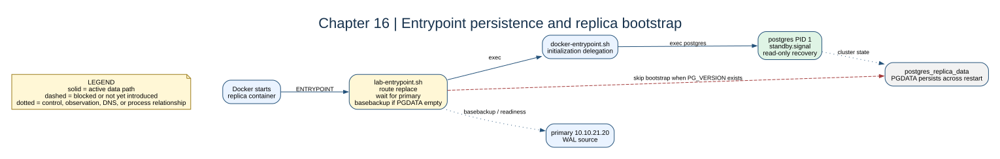

# Chapter 16: Runtime Configuration Persistence



## Key concepts

- **Idempotent** setup can run repeatedly and converge on the same state;
  `ip route replace` is used instead of a non-repeatable `ip route add`.
- A named Docker **volume** persists PostgreSQL cluster state separately from
  the container filesystem.
- `PG_VERSION` is the bootstrap sentinel used here to decide whether the
  replica volume is empty.
- The wrapper must `exec` the official PostgreSQL entrypoint so signals and
  exit status reach the real server.

## Goal

Move manually added routes and replica bootstrap into idempotent entrypoints
so recreation produces the same runtime state.

## Adds

The replica entrypoint waits for the primary, runs `pg_basebackup` only when
the volume is empty, writes a password file for future WAL connections, and
then delegates to the official PostgreSQL entrypoint.

## Checkpoint

```bash
bash scripts/compose-stage.sh 16 up -d --build --wait
bash scripts/compose-stage.sh 16 exec postgres-replica psql -U labadmin -d labdb -c 'SELECT pg_is_in_recovery();'
bash scripts/compose-stage.sh 16 exec postgres-primary psql -U labadmin -d labdb -c 'SELECT client_addr, state FROM pg_stat_replication;'
```

`ip route replace` is used because it is safe whether the route already exists
or not. `exec` preserves correct signal handling for the final PostgreSQL PID.

Expected observation: a clean volume performs one base backup; a restart keeps
the cluster and reapplies routes without copying the database again. Inspect
the replica logs for readiness, standby mode, and WAL streaming.

## Break it

Restart the replica and inspect its routes. Then compare that with a route
added manually in a disposable diagnostic container.
