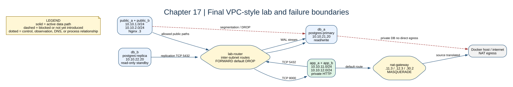

# Chapter 17: Failure Testing and Cloud Mapping



## Key concepts

- A **failure experiment** changes one layer at a time and records the symptom
  before applying a fix.
- The useful diagnostic order is: route, neighbor, packet capture, firewall,
  TCP listener, application protocol, then authentication.
- The cloud mapping is an analogy for design reasoning, not a claim that Docker
  provides managed VPC, NAT, or database failover semantics.

## Goal

Use repeatable checks to validate the final architecture, then intentionally
remove one dependency at a time and map the result to VPC concepts.

## Adds

No new service is required. This chapter adds the verification scripts in the
repository root and completes the final teaching loop.

## Checkpoint

```bash
bash scripts/test-routing.sh
bash scripts/test-firewall.sh
bash scripts/test-nat.sh
bash scripts/test-replication.sh
```

The final mapping is: Docker bridge subnet to VPC subnet, router container to
routing fabric, `iptables` to stateful filtering, NAT container to managed NAT
Gateway, Nginx to a public load-balancing tier, and the replica to a standby
across an availability zone or region.

## Experiment protocol

1. Start from a passing checkpoint and record the relevant route/rule counter.
2. Change exactly one dependency.
3. Capture the symptom and identify the first layer where behavior differs.
4. Restore by recreating the affected service or reset with
   `bash scripts/compose-stage.sh 17 down -v`.
5. Re-run every final verification script before starting another failure.

## Break it

Run these one at a time and recreate the stack afterward:

1. Delete an app return route.
2. Change `FORWARD` to `ACCEPT`.
3. Stop `nginx-a`.
4. Stop the primary.
5. Remove the replica's WAL connection.

Write down the symptom, the layer where it appears, and the command that
proved the cause.
