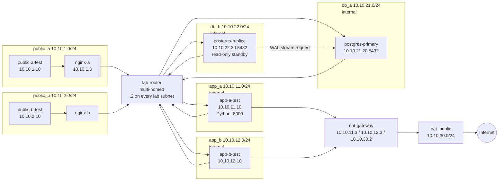
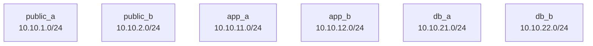
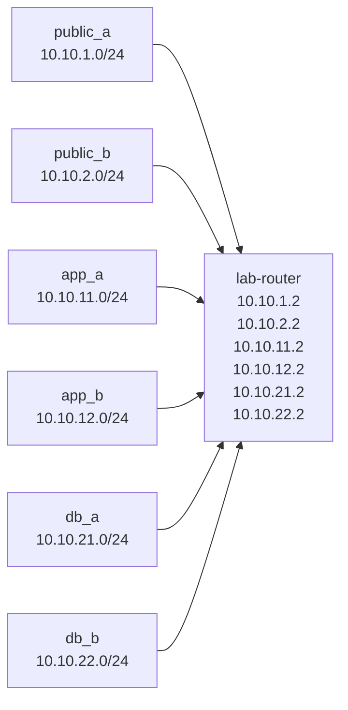
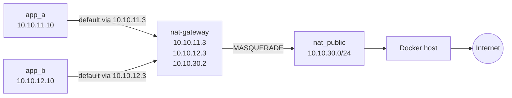
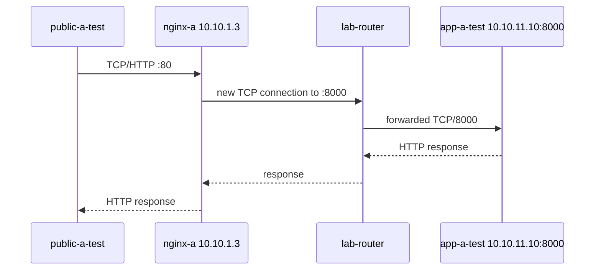
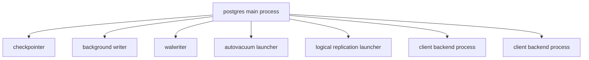
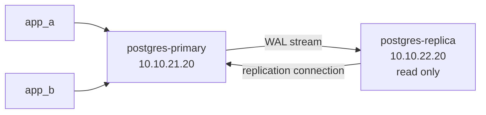
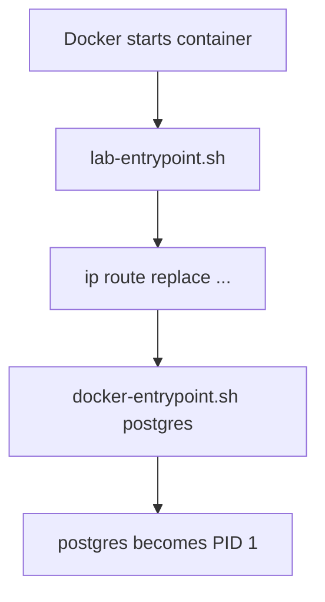

# Docker Networking & VPC-Style Infrastructure Lab

> A progressive, hands-on course built from the actual lab journey: questions, mistakes, fixes, commands, network diagrams, Compose evolution, and troubleshooting.

> **Runnable implementation:** use `README.md` and the numbered `chapters/`
> directories for the cumulative lab, `GLOSSARY.md` for defined terminology,
> and `COURSE_AUDIT.md` for the documented gaps and remediations. Each runnable
> chapter includes a labeled `diagram.svg`, `diagram.png`, and editable
> `diagram.dot` network view.

## Introduction

This course is a guided construction of a small VPC-style infrastructure lab
using Docker containers and Linux networking primitives. Its purpose is not to
memorize Compose syntax; it is to make the behavior of a real network visible,
testable, and explainable.

The learner starts with the smallest useful building block: a container whose
PID 1 process controls its lifetime. The lab then grows through six isolated
Docker bridge networks representing public, application, and database zones in
two regions. A multi-homed Linux router connects the zones, static routes teach
containers how to reach remote subnets, and `iptables` makes the permitted
traffic explicit.

Later chapters add the private-network egress path and explain NAT gateway
behavior at packet level. Nginx becomes the public HTTP layer, PostgreSQL
becomes the writable database primary, and a second PostgreSQL container is
initialized as a physical streaming replica. Runtime entrypoints then make the
network and database setup repeatable after container recreation.

The central question in every lesson is:

```text
What happens to this packet, process, or database change at each layer?
```

The course answers that question through diagrams, commands, packet captures,
rule counters, process inspection, SQL queries, and controlled failure
experiments. The final Docker design is a teaching model for cloud concepts,
not a production VPC replacement, but the troubleshooting habits transfer
directly to real infrastructure.

## Executable Chapter Index

Use the chapter links below to move from the narrative curriculum into the
cumulative Compose lab. Each chapter loads its own overlay together with every
earlier overlay.

| Chapter | Executable lesson |
|---|---|
| 01 | [Container process model](chapters/01-container-process/) |
| 02 | [CIDR and bridge networks](chapters/02-cidr-bridges/) |
| 03 | [Network namespaces](chapters/03-network-namespaces/) |
| 04 | [Linux capabilities](chapters/04-capabilities/) |
| 05 | [Multi-homed router](chapters/05-router-container/) |
| 06 | [Static routing](chapters/06-static-routing/) |
| 07 | [Packet tracing](chapters/07-packet-tracing/) |
| 08 | [Stateful firewalling](chapters/08-iptables-firewall/) |
| 09 | [Private networks](chapters/09-private-networks/) |
| 10 | [NAT gateway](chapters/10-nat-gateway/) |
| 11 | [Docker DNS](chapters/11-docker-dns/) |
| 12 | [Nginx public access](chapters/12-nginx-public-access/) |
| 13 | [PostgreSQL primary](chapters/13-postgres-primary/) |
| 14 | [PostgreSQL process model](chapters/14-postgres-process-model/) |
| 15 | [Physical streaming replication](chapters/15-physical-replication/) |
| 16 | [Runtime persistence](chapters/16-runtime-persistence/) |
| 17 | [Failure testing](chapters/17-failure-testing/) |

---

## Why Markdown is the primary format

Markdown is the best source format for this course because it is:

- easy to version-control in Git;
- easy to review as the lab changes;
- ideal for shell commands, SQL, YAML, and configuration files;
- compatible with Mermaid diagrams for architecture changes;
- easy to publish directly on a portfolio or documentation website;
- easy to convert later to PDF, DOCX, or slides.

The recommended workflow is:

```text
Markdown source
    |
    +--> GitHub / portfolio website
    +--> PDF export
    +--> DOCX export
    +--> course slides
```

---

# Course Outcomes

By the end of the lab, the learner should be able to explain and build:

1. Docker container process and network fundamentals.
2. User-defined bridge networks and subnetting.
3. Linux network namespaces and interfaces.
4. Static routing across isolated Docker subnets.
5. A multi-homed Linux router container.
6. `net.ipv4.ip_forward`.
7. Packet tracing with `tcpdump`.
8. Stateful firewalling with `iptables` and conntrack.
9. Port-level segmentation.
10. Private/internal Docker networks.
11. NAT gateway behavior with MASQUERADE/SNAT.
12. DNS behavior inside Docker containers.
13. Nginx as a public reverse proxy.
14. App-to-database routing.
15. PostgreSQL process architecture.
16. Physical PostgreSQL streaming replication.
17. Runtime configuration persistence with Docker entrypoints.
18. Failure testing and cloud/VPC mapping.

---

# Final Target Architecture



---

# Module 1 — Containers, PID 1, ENTRYPOINT and CMD

## What we learned

A container is not a virtual machine. Processes inside containers share the host Linux kernel but run in isolated namespaces and cgroups.

A container stays alive while its main process, PID 1, stays alive.

Example:

```yaml
command: ["sleep", "infinity"]
```

This was used to keep Alpine diagnostic containers alive.

## Learner questions

### “What is `sleep infinity` doing?”

It becomes PID 1 and keeps the container alive indefinitely.

### “What is the difference between ENTRYPOINT and CMD?”

- `ENTRYPOINT` defines the main executable or startup wrapper.
- `CMD` provides the default command or default arguments.
- The command can be overridden when starting the container.

### “What does `exec "$@"` do?”

It replaces the current shell process with the command passed to the script.

Example:

```sh
exec "$@"
```

This is important because the final application can become PID 1 and receive signals correctly.

## PostgreSQL example

The official image effectively follows:

```text
docker-entrypoint.sh
        |
        v
initialization/setup
        |
        v
exec postgres
        |
        v
postgres becomes PID 1
```

---

# Module 2 — CIDR and the Six-Subnet Lab

We built six user-defined Docker bridge networks.

| Network | CIDR | Role |
|---|---|---|
| public_a | 10.10.1.0/24 | public zone A |
| public_b | 10.10.2.0/24 | public zone B |
| app_a | 10.10.11.0/24 | private app zone A |
| app_b | 10.10.12.0/24 | private app zone B |
| db_a | 10.10.21.0/24 | private DB zone A |
| db_b | 10.10.22.0/24 | private DB zone B |

## Learner questions

### “What does /24 mean?”

IPv4 has 32 bits.

```text
/24 = 24 network bits + 8 host bits
```

Example:

```text
10.10.1.0/24
```

contains addresses in the `10.10.1.x` range.

### “Does Docker use DHCP here?”

No. Docker uses its own IP Address Management, IPAM, for user-defined bridge networks. It assigns the container interface directly.

---

# Stage 1 Compose — Six isolated test containers

```yaml
services:
  public-a-test:
    image: alpine:3.20
    command: ["sleep", "infinity"]
    networks:
      public_a:
        ipv4_address: 10.10.1.10

  public-b-test:
    image: alpine:3.20
    command: ["sleep", "infinity"]
    networks:
      public_b:
        ipv4_address: 10.10.2.10

  app-a-test:
    image: alpine:3.20
    command: ["sleep", "infinity"]
    networks:
      app_a:
        ipv4_address: 10.10.11.10

  app-b-test:
    image: alpine:3.20
    command: ["sleep", "infinity"]
    networks:
      app_b:
        ipv4_address: 10.10.12.10

  db-a-test:
    image: alpine:3.20
    command: ["sleep", "infinity"]
    networks:
      db_a:
        ipv4_address: 10.10.21.10

  db-b-test:
    image: alpine:3.20
    command: ["sleep", "infinity"]
    networks:
      db_b:
        ipv4_address: 10.10.22.10

networks:
  public_a:
    ipam:
      config:
        - subnet: 10.10.1.0/24

  public_b:
    ipam:
      config:
        - subnet: 10.10.2.0/24

  app_a:
    internal: true
    ipam:
      config:
        - subnet: 10.10.11.0/24

  app_b:
    internal: true
    ipam:
      config:
        - subnet: 10.10.12.0/24

  db_a:
    internal: true
    ipam:
      config:
        - subnet: 10.10.21.0/24

  db_b:
    internal: true
    ipam:
      config:
        - subnet: 10.10.22.0/24
```

## Architecture



At this point, all six networks are separate.

---

# Module 3 — Linux Network Namespaces and Interfaces

Each container gets its own network namespace containing:

- interfaces;
- routing table;
- neighbor/ARP table;
- loopback interface.

Useful commands:

```bash
ip addr
ip -br addr
ip route
ip neigh
```

On Alpine, install full `iproute2` if required:

```bash
apk add iproute2
```

## Learner question

### “What is `ip neigh`?”

For IPv4, it is effectively the ARP neighbor cache.

It maps:

```text
next-hop IPv4 address -> MAC address
```

It is not a full inventory of every machine on the network.

---

# Module 4 — Linux Capabilities and `CAP_NET_ADMIN`

Initially, attempts to add routes failed because containers did not have permission to modify their network configuration.

The fix was:

```yaml
cap_add:
  - NET_ADMIN
```

## Definition

`CAP_NET_ADMIN` is a Linux capability granting privileged network operations such as:

- adding routes;
- modifying interfaces;
- manipulating firewall rules;
- changing some networking settings.

## Learner question

### “Why does root inside the container still need CAP_NET_ADMIN?”

Container root is intentionally restricted. Docker drops many Linux capabilities by default.

Root inside a container is therefore not equivalent to unrestricted host root.

---

# Stage 2 Compose — Add NET_ADMIN

```yaml
app-a-test:
  image: alpine:3.20
  command: ["sleep", "infinity"]
  cap_add:
    - NET_ADMIN
  networks:
    app_a:
      ipv4_address: 10.10.11.10
```

The same capability was added to the other diagnostic containers that needed manual route changes.

---

# Module 5 — Multi-Homed Router Container

We created `lab-router` and attached it to all six networks.

Observed interfaces included:

```text
10.10.1.2/24
10.10.2.2/24
10.10.11.2/24
10.10.12.2/24
10.10.21.2/24
10.10.22.2/24
```

## Key concept

Because the router is directly attached to all six subnets, Linux automatically installs connected routes.

The router itself does **not** need static routes for those directly connected subnets.

## Enable forwarding

```bash
sysctl -w net.ipv4.ip_forward=1
```

## Definition

`ip_forward=1` allows the Linux kernel to forward IPv4 packets between interfaces.

Without it, the container can communicate as an endpoint but not function as a router.

---

# Architecture after router introduction



---

# Module 6 — Static Routing and Next-Hop Gateways

Each ordinary container must know that remote lab subnets are reached through the router.

Example from `app-a-test`:

```bash
ip route add 10.10.1.0/24 via 10.10.11.2
ip route add 10.10.2.0/24 via 10.10.11.2
ip route add 10.10.12.0/24 via 10.10.11.2
ip route add 10.10.21.0/24 via 10.10.11.2
ip route add 10.10.22.0/24 via 10.10.11.2
```

## Learner question

### “Why use `10.10.11.2`?”

Because the next hop must be reachable on the sender’s own local subnet.

`app-a-test` is on:

```text
10.10.11.0/24
```

so it uses the router's address on that subnet:

```text
10.10.11.2
```

## Core mental model

```text
routing table = WHERE the packet goes
iptables      = WHETHER the packet is allowed
```

---

# Module 7 — Packet Tracing with tcpdump

We verified packet forwarding with:

```bash
tcpdump -i any -nn icmp
```

Observed flow:

```text
public_a -> router ingress
router -> app_b egress
app_b -> router ingress
router -> public_a egress
```

## Useful options

```text
-i any   listen on all interfaces
-nn      do not resolve names or service names
-q       quieter output
-vv      more verbose packet details
-tttt    readable timestamps
```

---

# Module 8 — iptables and Stateful Firewalling

Install:

```bash
apk add iptables
```

General syntax:

```bash
iptables -t <TABLE> -A <CHAIN> <MATCHES> -j <TARGET>
```

## Important options

| Option | Meaning |
|---|---|
| `-t` | table |
| `-A` | append rule |
| `-I` | insert rule |
| `-D` | delete rule |
| `-F` | flush rules |
| `-P` | set default policy |
| `-s` | source |
| `-d` | destination |
| `-i` | incoming interface |
| `-o` | outgoing interface |
| `-p` | protocol |
| `--dport` | destination port |
| `-j` | action/target |

## Filter chains

```text
INPUT
OUTPUT
FORWARD
```

The router primarily uses `FORWARD`.

---

# Stage 3 Firewall — Port-level segmentation

```bash
iptables -P FORWARD DROP

iptables -A FORWARD \
  -m conntrack \
  --ctstate ESTABLISHED,RELATED \
  -j ACCEPT

iptables -A FORWARD \
  -s 10.10.1.0/24 \
  -d 10.10.11.0/24 \
  -p tcp \
  --dport 8000 \
  -j ACCEPT

iptables -A FORWARD \
  -s 10.10.2.0/24 \
  -d 10.10.12.0/24 \
  -p tcp \
  --dport 8000 \
  -j ACCEPT

iptables -A FORWARD \
  -s 10.10.11.0/24 \
  -d 10.10.21.0/24 \
  -p tcp \
  --dport 5432 \
  -j ACCEPT

iptables -A FORWARD \
  -s 10.10.12.0/24 \
  -d 10.10.21.0/24 \
  -p tcp \
  --dport 5432 \
  -j ACCEPT
```

Replication later required:

```bash
iptables -A FORWARD \
  -s 10.10.22.0/24 \
  -d 10.10.21.0/24 \
  -p tcp \
  --dport 5432 \
  -j ACCEPT
```

## Learner question

### “What does `ESTABLISHED,RELATED` do?”

Conntrack remembers connection state.

For a permitted TCP connection:

```text
client -> server = NEW
server -> client = ESTABLISHED
```

The return traffic is allowed without needing a separate reverse-direction allow rule.

---

# Inspecting firewall rules

```bash
iptables -S FORWARD
```

Command-style output.

```bash
iptables -L FORWARD -n -v --line-numbers
```

Shows counters and rule numbers.

Example observed:

```text
Chain FORWARD (policy DROP)
1 ACCEPT ctstate RELATED,ESTABLISHED
2 ACCEPT 10.10.1.0/24 -> 10.10.11.0/24 tcp dpt:8000
3 ACCEPT 10.10.2.0/24 -> 10.10.12.0/24 tcp dpt:8000
4 ACCEPT 10.10.11.0/24 -> 10.10.21.0/24 tcp dpt:5432
```

---

# Module 9 — Private Networks and Default Routes

`app_a`, `app_b`, `db_a`, and `db_b` were marked:

```yaml
internal: true
```

This removes normal Docker internet egress.

Example app route table:

```text
10.10.11.0/24 dev eth0
10.10.21.0/24 via 10.10.11.2
...
```

There was no default route initially.

## Learner question

### “What is a default route?”

The default route is the catch-all route used when no more-specific route matches.

Example:

```text
default via 10.10.11.3 dev eth0
```

---

# Module 10 — NAT Gateway

A separate `nat-gateway` was built to teach outbound NAT independently from the router.

Interfaces:

```text
10.10.11.3   app_a
10.10.12.3   app_b
10.10.30.2   nat_public
```

## NAT routes

Apps use:

```bash
ip route add default via 10.10.11.3
```

or:

```bash
ip route add default via 10.10.12.3
```

## MASQUERADE

```bash
iptables -t nat -A POSTROUTING \
  -s 10.10.11.0/24 \
  -o eth3 \
  -j MASQUERADE
```

and:

```bash
iptables -t nat -A POSTROUTING \
  -s 10.10.12.0/24 \
  -o eth3 \
  -j MASQUERADE
```

## Definition

MASQUERADE rewrites the outgoing source address to the current address of the egress interface.

## Important debugging lesson

The NAT gateway initially had its default route through the Docker default bridge:

```text
default via 172.17.0.1 dev eth0
```

but the MASQUERADE rule expected traffic to leave `eth3`.

Counters remained zero.

Fix:

```bash
ip route del default
ip route add default via 10.10.30.1 dev eth3
```

This demonstrated:

```text
NAT does not choose the route.
Routing chooses the interface.
NAT modifies the packet afterward.
```

---

# NAT Architecture



---

# Module 11 — Docker DNS

Inside user-defined Docker networks, `/etc/resolv.conf` commonly contains:

```text
nameserver 127.0.0.11
```

## Learner question

### “Is 127.0.0.11 just an address inside the container?”

Yes.

It is Docker's embedded DNS resolver exposed through the container's network namespace.

External lookup path:

```text
container
   |
   v
127.0.0.11
   |
   v
Docker embedded DNS
   |
   v
host/upstream resolver
```

## Important lesson

Raw IP connectivity and DNS are separate.

We observed:

```bash
ping 8.8.8.8
```

working while:

```bash
ping dl-cdn.alpinelinux.org
```

failed.

This became an intentional troubleshooting lesson:

```text
IP works + hostname fails = investigate DNS, not routing first
```

Temporary resolver override:

```bash
printf 'nameserver 8.8.8.8\nnameserver 1.1.1.1\n' > /etc/resolv.conf
```

Compose-based version:

```yaml
dns:
  - 8.8.8.8
  - 1.1.1.1
```

---

# Module 12 — Nginx Public Access Layer

`nginx-a` was attached to `public_a`.

Example:

```text
nginx-a = 10.10.1.3
app-a-test = 10.10.11.10:8000
```

Python diagnostic server:

```bash
python3 -m http.server 8000 --bind 0.0.0.0
```

Nginx config:

```nginx
server {
    listen 80;

    location / {
        proxy_pass http://10.10.11.10:8000;
    }
}
```

Write config without an editor:

```bash
cat > /etc/nginx/conf.d/default.conf <<'EOF'
server {
    listen 80;

    location / {
        proxy_pass http://10.10.11.10:8000;
    }
}
EOF
```

Then:

```bash
nginx -t
nginx -s reload
```

## Learner questions

### “Why use sudo tee if cat can write?”

Because shell redirection is performed by the current shell.

This often fails:

```bash
sudo cat > /root-owned-file
```

The `>` is still handled by the unprivileged shell.

Instead:

```bash
echo "text" | sudo tee /root-owned-file
```

lets `tee` perform the privileged write.

Inside many containers, the shell is already root, so `cat > file` is fine.

---

# Nginx Request Path



## Important conceptual correction

Nginx does not simply forward the exact client TCP connection.

There are two TCP connections:

```text
client <-> nginx
nginx  <-> app
```

---

# Module 13 — Netcat (`nc`) for Port Testing

Example:

```bash
nc -vz 10.10.21.20 5432
```

Meaning:

```text
nc    netcat
-v    verbose
-z    connection test / scan mode
```

If it says:

```text
open
```

the TCP handshake succeeded.

It does **not** prove application authentication or SQL works.

---

# Module 14 — PostgreSQL Primary in db_a

Primary:

```text
10.10.21.20/24
```

App route:

```text
10.10.21.0/24 via 10.10.11.2
```

Primary return route:

```bash
ip route add 10.10.11.0/24 via 10.10.21.2
```

For `app_b`:

```bash
ip route add 10.10.12.0/24 via 10.10.21.2
```

## Troubleshooting case

From `app-a-test`:

```bash
nc -vz 10.10.21.20 5432
```

initially hung.

Router counters showed the TCP 5432 rule incrementing, proving the forward path reached the router.

The PostgreSQL container only had:

```text
10.10.21.0/24 dev eth1
```

It lacked a return route to `10.10.11.0/24`.

Fix:

```bash
ip route add 10.10.11.0/24 via 10.10.21.2
```

Then `nc` reported the port open.

## Lesson

A successful forward route is not enough.

Always verify the return path.

---

# Module 15 — PostgreSQL Linux Process Model

Learner observation:

```text
postgres
postgres: checkpointer
postgres: background writer
postgres: walwriter
postgres: autovacuum launcher
postgres: logical replication launcher
```

PostgreSQL is a multi-process server.

It traditionally creates one backend OS process per client connection in addition to background processes.



This is one reason connection pooling tools such as PgBouncer are useful.

---

# Module 16 — Linux Job Control

Foreground process:

```bash
python3 -m http.server 8000
```

Suspend:

```text
Ctrl+Z
```

Resume in background:

```bash
bg
```

Start directly in background:

```bash
command &
```

List jobs:

```bash
jobs
```

Bring job 1 foreground:

```bash
fg %1
```

Bring job 2 foreground:

```bash
fg %2
```

## Learner question

### “Does bg suspend it?”

No.

```text
Ctrl+Z = suspend
bg     = resume in background
```

## tmux comparison

A normal background job remains associated with the shell and may terminate when the shell exits.

tmux keeps the terminal session alive after detach or SSH disconnect.

---

# Module 17 — PostgreSQL Physical Replication

Final desired DB architecture:



Both app regions use the single writable primary.

The replica lives in the second DB region.

---

# Physical vs Logical Replication

This lab uses:

```text
physical streaming replication
```

Initial state:

```text
pg_basebackup = physical copy of the entire PostgreSQL cluster
```

Continuous state:

```text
primary writes WAL
     |
     v
WAL streamed to replica
     |
     v
replica replays WAL
```

Logical replication instead works with logical changes such as inserts, updates, and deletes and can target selected publications/tables.

---

# Module 18 — Primary Replication Configuration

Check server settings from inside `psql`:

```sql
SHOW wal_level;
SHOW max_wal_senders;
```

Observed:

```text
wal_level = replica
max_wal_senders = 10
```

Create replication role:

```sql
CREATE ROLE replicator
WITH REPLICATION LOGIN PASSWORD 'replica_password';
```

Add to primary `pg_hba.conf`:

```text
host replication replicator 10.10.22.0/24 scram-sha-256
```

## Meaning

```text
host
    TCP/IP connection

replication
    physical replication connection

replicator
    PostgreSQL role allowed to make the connection

10.10.22.0/24
    source network containing the replica

scram-sha-256
    password authentication method
```

Important:

`pg_hba.conf` is not the network firewall.

```text
iptables
    decides whether packet reaches PostgreSQL

pg_hba.conf
    decides whether PostgreSQL accepts the connection
```

Reload:

```sql
SELECT pg_reload_conf();
```

---

# Module 19 — Replica Initialization with `pg_basebackup`

A normal `postgres:16` container initializes its own data directory automatically.

That initially caused:

```text
pg_basebackup: directory "/var/lib/postgresql/data" exists but is not empty
```

## Learner insight

Instead of starting PostgreSQL immediately, start the replica container with:

```bash
sleep infinity
```

This keeps the container alive while avoiding a running PostgreSQL server.

Example:

```bash
docker run -d \
  --name postgres-replica \
  --cap-add NET_ADMIN \
  postgres:16 \
  sleep infinity
```

Then prepare:

```bash
mkdir -p /var/lib/postgresql/data
chown -R postgres:postgres /var/lib/postgresql/data
chmod 700 /var/lib/postgresql/data
```

## Why 0700?

PostgreSQL rejects excessively permissive PGDATA permissions.

Observed error:

```text
FATAL: data directory has invalid permissions
DETAIL: Permissions should be 0700 or 0750.
```

---

# Run `pg_basebackup` from the replica

```bash
pg_basebackup \
  -h 10.10.21.20 \
  -U replicator \
  -D /var/lib/postgresql/data \
  -Fp \
  -Xs \
  -P \
  -R
```

Options:

| Option | Meaning |
|---|---|
| `-h` | primary host |
| `-U` | replication user |
| `-D` | target data directory |
| `-Fp` | plain directory format |
| `-Xs` | stream WAL during backup |
| `-P` | show progress |
| `-R` | generate standby configuration |

Observed success:

```text
30848/30848 kB (100%), 1/1 tablespace
```

---

# `-R` Output

`postgresql.auto.conf` contained:

```text
primary_conninfo = 'user=replicator ... host=10.10.21.20 port=5432 ...'
```

This tells the replica how to reconnect to the primary.

`standby.signal` tells PostgreSQL to start as a standby.

---

# Start replica manually

While `sleep infinity` is PID 1:

```bash
/usr/lib/postgresql/16/bin/postgres \
  -D /var/lib/postgresql/data
```

Observed logs:

```text
entering standby mode
database system is ready to accept read-only connections
started streaming WAL from primary
```

This confirmed physical streaming replication.

Verify:

```sql
SELECT pg_is_in_recovery();
```

Replica:

```text
t
```

Primary:

```text
f
```

Attempting an INSERT on replica correctly returned:

```text
ERROR: cannot execute INSERT in a read-only transaction
```

---

# Module 20 — Verify Replication

On primary:

```sql
SELECT client_addr, state, sync_state
FROM pg_stat_replication;
```

Expected:

```text
client_addr = 10.10.22.20
state       = streaming
```

Insert on primary:

```sql
INSERT INTO users (name)
VALUES ('replication-test');
```

Then on replica:

```sql
SELECT * FROM users;
```

The new row should appear.

---

# Module 21 — Runtime State vs Persistent Container Configuration

We discovered that manually executing:

```bash
ip route add ...
```

and:

```bash
iptables -A ...
```

modifies runtime network namespace/kernel state.

That state is not a durable Docker configuration.

A restart/recreation can wipe it.

## Better pattern

Use:

- Dockerfile for required binaries;
- entrypoint script for runtime configuration;
- Compose for capabilities/network attachments.

---

# Custom Entry Point Pattern

The base PostgreSQL image already has:

```text
docker-entrypoint.sh
```

Our custom script should wrap it:

```sh
#!/bin/sh
set -e

ip route replace 10.10.21.0/24 via 10.10.22.2

exec docker-entrypoint.sh "$@"
```

Why `replace`?

```bash
ip route replace ...
```

is idempotent. It works whether or not the route already exists.

Dockerfile:

```dockerfile
FROM postgres:16

RUN apt-get update \
    && apt-get install -y iproute2 \
    && rm -rf /var/lib/apt/lists/*

COPY lab-entrypoint.sh /usr/local/bin/lab-entrypoint.sh
RUN chmod +x /usr/local/bin/lab-entrypoint.sh

ENTRYPOINT ["/usr/local/bin/lab-entrypoint.sh"]
CMD ["postgres"]
```

Startup flow:



Important:

The container still requires:

```yaml
cap_add:
  - NET_ADMIN
```

---

# Stage-by-Stage Compose Evolution

## Stage A — Diagnostic containers only

```yaml
services:
  app-a-test:
    image: alpine:3.20
    command: ["sleep", "infinity"]
    networks:
      app_a:
        ipv4_address: 10.10.11.10
```

## Stage B — Grant network administration

```yaml
services:
  app-a-test:
    image: alpine:3.20
    command: ["sleep", "infinity"]
    cap_add:
      - NET_ADMIN
```

## Stage C — Router

```yaml
services:
  lab-router:
    build: ./router
    cap_add:
      - NET_ADMIN
    sysctls:
      net.ipv4.ip_forward: "1"
    networks:
      public_a:
        ipv4_address: 10.10.1.2
      public_b:
        ipv4_address: 10.10.2.2
      app_a:
        ipv4_address: 10.10.11.2
      app_b:
        ipv4_address: 10.10.12.2
      db_a:
        ipv4_address: 10.10.21.2
      db_b:
        ipv4_address: 10.10.22.2
```

## Stage D — NAT gateway

```yaml
services:
  nat-gateway:
    build: ./nat
    cap_add:
      - NET_ADMIN
    sysctls:
      net.ipv4.ip_forward: "1"
    networks:
      app_a:
        ipv4_address: 10.10.11.3
      app_b:
        ipv4_address: 10.10.12.3
      nat_public:
        ipv4_address: 10.10.30.2
```

## Stage E — Nginx public layer

```yaml
services:
  nginx-a:
    image: nginx:alpine
    cap_add:
      - NET_ADMIN
    networks:
      public_a:
        ipv4_address: 10.10.1.3
```

## Stage F — PostgreSQL primary

```yaml
services:
  postgres-primary:
    image: postgres:16
    environment:
      POSTGRES_PASSWORD: postgres
      POSTGRES_DB: labdb
    cap_add:
      - NET_ADMIN
    networks:
      db_a:
        ipv4_address: 10.10.21.20
```

## Stage G — PostgreSQL replica with persistent route wrapper

```yaml
services:
  postgres-replica:
    build: ./postgres-replica
    cap_add:
      - NET_ADMIN
    volumes:
      - postgres_replica_data:/var/lib/postgresql/data
    networks:
      db_b:
        ipv4_address: 10.10.22.20

volumes:
  postgres_replica_data:
```

---

# Implemented Progressive Repository Structure

The lab is implemented as cumulative chapter directories rather than a set of
flat lesson files. Each `compose.yaml` is an overlay: the chapter runner loads
it together with every earlier overlay, so a learner can start at any chapter
without losing the infrastructure built previously.

```text
docker-networking-vpc-lab/
├── README.md
├── docker-networking-vpc-lab-course.md
├── chapters/
│   ├── README.md
│   ├── 01-container-process/
│   ├── 02-cidr-bridges/
│   ├── 03-network-namespaces/
│   ├── 04-capabilities/
│   │   └── tools/Dockerfile
│   ├── 05-router-container/
│   │   └── router/{Dockerfile,entrypoint.sh}
│   ├── 06-static-routing/
│   ├── 07-packet-tracing/
│   ├── 08-iptables-firewall/
│   │   └── router/{Dockerfile,entrypoint.sh}
│   ├── 09-private-networks/
│   ├── 10-nat-gateway/
│   │   └── nat/{Dockerfile,entrypoint.sh}
│   ├── 11-docker-dns/
│   ├── 12-nginx-public-access/
│   │   └── nginx/{Dockerfile,entrypoint.sh,default.conf.template}
│   ├── 13-postgres-primary/
│   │   └── postgres-primary/{Dockerfile,lab-entrypoint.sh,init.sql,pg_hba.conf}
│   ├── 14-postgres-process-model/
│   ├── 15-physical-replication/
│   │   └── postgres-replica/{Dockerfile,lab-entrypoint.sh}
│   ├── 16-runtime-persistence/
│   │   └── postgres-replica/{Dockerfile,lab-entrypoint.sh,pg_hba.conf}
│   └── 17-failure-testing/
└── scripts/
    ├── compose-stage.sh
    ├── test-routing.sh
    ├── test-firewall.sh
    ├── test-nat.sh
    └── test-replication.sh
```

---

# Troubleshooting Catalogue

## 1. `ip route` permission denied

Cause:

```text
missing CAP_NET_ADMIN
```

Fix:

```yaml
cap_add:
  - NET_ADMIN
```

---

## 2. Router sees packets but destination does not reply

Check:

```bash
tcpdump -i any -nn
iptables -L FORWARD -n -v
ip route
```

Most important lesson:

```text
forward path and return path must both exist
```

---

## 3. `nc` hangs

Possible causes:

- route missing;
- firewall DROP;
- return route missing;
- service not listening.

Use:

```bash
nc -vz -w 3 <ip> <port>
```

---

## 4. `Connection refused`

Usually means:

```text
network path reached the host,
but no process is listening on that port
```

Different from a timeout/drop.

---

## 5. Raw IP works but hostname fails

Likely DNS.

Inspect:

```bash
cat /etc/resolv.conf
```

---

## 6. NAT rule counters stay at zero

Check:

```bash
ip route get 8.8.8.8
```

Routing may be selecting a different egress interface than the NAT rule expects.

---

## 7. `pg_basebackup` says directory not empty

The replica already initialized its own cluster.

For physical replication, the replica PGDATA must be populated from the primary base backup instead.

---

## 8. PostgreSQL data directory invalid permissions

Required:

```text
0700
```

or:

```text
0750
```

Example:

```bash
chmod 700 /var/lib/postgresql/data
```

---

## 9. SQL command gives `bash: command not found`

Example:

```text
SHOW wal_level;
```

was run in Bash.

SQL belongs inside `psql`, or use:

```bash
psql -U postgres -c "SHOW wal_level;"
```

---

# Cloud Mapping

| Lab concept | Cloud equivalent |
|---|---|
| Docker subnet | VPC subnet |
| CIDR | VPC CIDR/subnet CIDR |
| container interface | ENI-like interface |
| `ip route` | route table |
| router container | routing fabric/router appliance |
| iptables filtering | security group/NACL concepts |
| conntrack | stateful firewall behavior |
| NAT gateway container | managed NAT Gateway |
| Nginx public tier | reverse proxy/load balancer |
| internal network | private subnet |
| tcpdump | packet capture/traffic mirroring |
| PostgreSQL replica | cross-AZ/cross-region DB standby pattern |

---

# Failure Experiments to Add Next

1. Delete the app return route and observe hanging TCP connections.
2. Delete the DB return route and watch `nc` hang.
3. Change `FORWARD` policy from DROP to ACCEPT and observe segmentation disappear.
4. Remove the conntrack rule and inspect broken replies.
5. Break NAT egress route while leaving MASQUERADE configured.
6. Break DNS while preserving raw IP connectivity.
7. Stop `nginx-a` and observe public-path failure.
8. Stop the primary and observe both apps lose writable DB access.
9. Promote the replica and study failover.
10. Introduce replication lag and measure it.
11. Break WAL streaming and inspect PostgreSQL logs.
12. Restart containers and observe manually added routes disappear.
13. Move routes/firewall rules into entrypoints and verify restart persistence.

---

# Next Course Modules

The natural next steps are:

```text
replication verification
        ↓
replication lag
        ↓
primary failure
        ↓
manual replica promotion
        ↓
application reconnect/failover
        ↓
health checks
        ↓
HAProxy/Nginx DB routing discussion
        ↓
observability
        ↓
automated Compose rebuild
        ↓
cloud/VPC mapping
```

---

# Key Mental Models Collected During the Lab

```text
Routing table = WHERE packets go.
iptables      = WHETHER packets are allowed.
ARP           = WHAT MAC address the next hop uses.
NAT           = HOW addresses are rewritten.
DNS           = HOW names become IP addresses.
Nginx         = application-layer reverse proxy.
conntrack     = connection state memory.
PGDATA        = physical PostgreSQL cluster state.
pg_basebackup = initial physical copy.
WAL streaming = continuous physical synchronization.
ENTRYPOINT    = container startup orchestration.
PID 1         = container lifecycle anchor.
```

---

# Course Philosophy

This course intentionally preserves mistakes and debugging moments instead of showing only the final configuration.

Every module should follow:

```text
build
  ↓
predict
  ↓
test
  ↓
break
  ↓
observe
  ↓
explain
  ↓
fix
  ↓
retest
  ↓
document
```

That is what turns the lab from a collection of Docker commands into a reusable infrastructure engineering course.
